# Lumos Framework - Architecture & End-to-End Flow

## Overview

Lumos is a **platform-agnostic metadata management framework** that provides a unified interface for ingesting, enriching, and managing metadata across different data catalog platforms (DataHub, Amundsen, etc.) and data sources (CSV, MongoDB, Avro, Parquet, S3, etc.).

The framework has been restructured with a clear separation between **core** platform abstractions and **feature** modules, following SOLID principles for maximum extensibility.

## Core Design Principles

- **Platform Agnostic**: Abstract interface allows switching between metadata platforms without code changes
- **Extensible**: Easy to add new data sources and platforms via handler pattern
- **Modular**: Clear separation of concerns with dedicated services
- **Configuration-Driven**: JSON/YAML-based configuration for all operations
- **SOLID Principles**: Single Responsibility, Open/Closed, Liskov Substitution, Interface Segregation, Dependency Inversion

## Architecture Diagram

```mermaid
graph TB
    subgraph "Entry Points"
        CLI[Framework CLI<br/>framework_cli.py]
        AIRFLOW[Airflow DAG<br/>orchestration_examples/]
        CUSTOM[Custom Scripts]
    end

    subgraph "Configuration Layer"
        CONFIG_MGR[ConfigManager<br/>core/common/config_manager.py]
        GLOBAL_CONFIG[global_settings.yaml<br/>Platform configs]
        JOB_CONFIG[Job Configs<br/>JSON/YAML configs]
    end

    subgraph "Controllers Layer"
        INGESTION_CTRL[IngestionController]
        LINEAGE_CTRL[LineageController]
        ENRICHMENT_CTRL[EnrichmentController]
        OWNERSHIP_CTRL[OwnershipController]
        VERSION_CTRL[VersionController]
        EXTRACTION_CTRL[Extraction via CLI]
    end

    subgraph "Feature Services"
        INGESTION_SVC[IngestionService<br/>feature/ingestion/]
        LINEAGE_SVC[DatasetLineageService<br/>feature/lineage/]
        ENRICHMENT_SVC[Enrichment Services<br/>feature/enrichment/]
        OWNERSHIP_SVC[OwnershipService<br/>feature/ownership/]
        VERSION_SVC[VersionManager<br/>feature/versioning/]
        EXTRACTION_SVC[Extraction Services<br/>feature/extraction/]
    end

    subgraph "Ingestion Handlers"
        CSV_HANDLER[CSV Handler<br/>feature/ingestion/handlers/csv.py]
        MONGO_HANDLER[MongoDB Handler<br/>feature/ingestion/handlers/mongo.py]
        AVRO_HANDLER[Avro Handler<br/>feature/ingestion/handlers/avro.py]
        PARQUET_HANDLER[Parquet Handler<br/>feature/ingestion/handlers/parquet.py]
        S3_HANDLER[S3 Handler<br/>feature/ingestion/handlers/s3.py]
    end

    subgraph "Platform Abstraction Layer"
        PLATFORM_INTERFACE[MetadataPlatformInterface<br/>core/platform/interface.py]
        PLATFORM_FACTORY[PlatformFactory<br/>core/platform/factory.py]
    end

    subgraph "Platform Implementations"
        DATAHUB[DataHub Handler<br/>core/platform/impl/datahub_handler.py]
        AMUNDSEN[Amundsen Handler<br/>Future implementation]
    end

    subgraph "Metadata Platforms"
        DATAHUB_INST[DataHub Instance<br/>localhost:8080]
        AMUNDSEN_INST[Amundsen Instance<br/>Future]
    end

    CLI --> CONFIG_MGR
    AIRFLOW --> CONFIG_MGR
    CUSTOM --> CONFIG_MGR

    CONFIG_MGR --> GLOBAL_CONFIG
    CONFIG_MGR --> JOB_CONFIG

    CLI --> INGESTION_CTRL
    CLI --> LINEAGE_CTRL
    CLI --> ENRICHMENT_CTRL
    CLI --> OWNERSHIP_CTRL
    CLI --> VERSION_CTRL
    CLI --> EXTRACTION_CTRL

    INGESTION_CTRL --> INGESTION_SVC
    LINEAGE_CTRL --> LINEAGE_SVC
    ENRICHMENT_CTRL --> ENRICHMENT_SVC
    OWNERSHIP_CTRL --> OWNERSHIP_SVC
    VERSION_CTRL --> VERSION_SVC
    EXTRACTION_CTRL --> EXTRACTION_SVC

    INGESTION_SVC --> CSV_HANDLER
    INGESTION_SVC --> MONGO_HANDLER
    INGESTION_SVC --> AVRO_HANDLER
    INGESTION_SVC --> PARQUET_HANDLER
    INGESTION_SVC --> S3_HANDLER

    CSV_HANDLER --> PLATFORM_INTERFACE
    MONGO_HANDLER --> PLATFORM_INTERFACE
    AVRO_HANDLER --> PLATFORM_INTERFACE
    LINEAGE_SVC --> PLATFORM_INTERFACE
    ENRICHMENT_SVC --> PLATFORM_INTERFACE
    OWNERSHIP_SVC --> PLATFORM_INTERFACE
    VERSION_SVC --> PLATFORM_INTERFACE
    EXTRACTION_SVC --> PLATFORM_INTERFACE

    PLATFORM_FACTORY --> PLATFORM_INTERFACE
    PLATFORM_FACTORY --> DATAHUB
    PLATFORM_FACTORY --> AMUNDSEN

    DATAHUB --> DATAHUB_INST
    AMUNDSEN --> AMUNDSEN_INST

    style PLATFORM_INTERFACE fill:#e1f5ff
    style PLATFORM_FACTORY fill:#e1f5ff
    style DATAHUB fill:#90EE90
    style AMUNDSEN fill:#FFE4B5
```



## Project Structure

```
project-lumos/
├── core/                           # Core framework components
│   ├── common/                     # Shared utilities and interfaces
│   │   ├── config_manager.py       # Configuration management
│   │   ├── urn_builders.py         # URN construction utilities
│   │   ├── emitter.py              # Metadata emission utilities
│   │   └── utils.py                # General utilities
│   ├── controllers/                # Operation controllers (CLI layer)
│   │   ├── ingestion_controller.py
│   │   ├── lineage_controller.py
│   │   ├── enrichment_controller.py
│   │   ├── ownership_controller.py
│   │   ├── version_controller.py
│   │   └── data_job_lineage_controller.py
│   └── platform/                   # Platform abstraction layer
│       ├── interface.py            # MetadataPlatformInterface
│       ├── factory.py              # PlatformFactory
│       └── impl/                   # Platform implementations
│           ├── datahub_handler.py
│           └── datahub_service.py
├── feature/                        # Feature-specific modules
│   ├── ownership/                  # Ownership management
│   │   ├── base_ownership_service.py
│   │   └── ownership_service.py
│   ├── ingestion/                  # Data ingestion
│   │   ├── handlers/               # Source-specific handlers
│   │   │   ├── base_ingestion_handler.py
│   │   │   ├── csv.py
│   │   │   ├── avro.py
│   │   │   ├── parquet.py
│   │   │   ├── mongo.py
│   │   │   ├── s3.py
│   │   │   └── factory.py
│   │   └── ingestion_service.py
│   ├── extraction/                 # Metadata extraction & analytics
│   │   ├── export/                 # Export formats
│   │   │   ├── excel_exporter.py
│   │   │   ├── csv_exporter.py
│   │   │   └── visualization_exporter.py
│   │   ├── extraction_factory.py   # 11 extraction types
│   │   ├── comprehensive_dataset_extractor.py
│   │   ├── schema_extractor_service.py
│   │   ├── lineage_extractor_service.py
│   │   ├── governance_extractor_service.py
│   │   ├── properties_extractor_service.py
│   │   ├── usage_extractor_service.py
│   │   ├── quality_extractor_service.py
│   │   ├── assertions_extractor_service.py
│   │   ├── profiling_extractor_service.py
│   │   ├── impact_extractor_service.py
│   │   └── metadata_diff_service.py
│   ├── enrichment/                 # Metadata enrichment
│   │   ├── base_enrichment_service.py
│   │   ├── description_service.py
│   │   ├── documentation_service.py
│   │   ├── tag_service.py
│   │   ├── properties_service.py
│   │   └── factory.py
│   ├── lineage/                    # Data lineage tracking
│   │   ├── dataset_lineage_service.py
│   │   └── data_job_service.py
│   ├── versioning/                 # Version management
│   │   ├── version_service.py
│   │   └── dataset_scanner.py
│   ├── profiling/                  # Data profiling
│   ├── dq_services/                # Data quality
│   └── rbac/                       # Access control
├── configs/                        # Configuration files
│   └── global_settings.yaml
├── sample_configs_and_templates/   # Example configurations
│   ├── ownership/
│   ├── ingestion/
│   ├── enrichment/
│   └── lineage/
└── framework_cli.py               # Command-line interface
```

## Component Details

### Controllers Layer (`core/controllers/`)

Controllers act as the CLI interface layer, orchestrating operations and delegating to feature services.

| Controller | Responsibility | Location |
|------------|---------------|----------|
| **IngestionController** | Orchestrates data source ingestion | `core/controllers/ingestion_controller.py` |
| **LineageController** | Manages dataset lineage operations | `core/controllers/lineage_controller.py` |
| **EnrichmentController** | Handles metadata enrichment | `core/controllers/enrichment_controller.py` |
| **OwnershipController** | Manages ownership operations (users, groups, assignments) | `core/controllers/ownership_controller.py` |
| **VersionController** | Handles versioning operations | `core/controllers/version_controller.py` |
| **DataJobLineageController** | Manages data job lineage | `core/controllers/data_job_lineage_controller.py` |

### Feature Services

| Service | Responsibility | Location |
|---------|---------------|----------|
| **IngestionService** | Orchestrates data source ingestion | `feature/ingestion/ingestion_service.py` |
| **DatasetLineageService** | Manages dataset lineage relationships | `feature/lineage/dataset_lineage_service.py` |
| **DataJobService** | Manages data job lineage | `feature/lineage/data_job_service.py` |
| **OwnershipService** | Manages ownership (users, groups, assignments) | `feature/ownership/ownership_service.py` |
| **VersionManager** | Manages dataset versioning | `feature/versioning/version_service.py` |
| **Enrichment Services** | Tags, descriptions, documentation, properties | `feature/enrichment/` |
| **Extraction Services** | 11 types of metadata extraction | `feature/extraction/` |

### Ingestion Handlers

| Handler | Source Type | Location |
|---------|-------------|----------|
| **CSV Handler** | CSV files | `feature/ingestion/handlers/csv.py` |
| **MongoIngestionHandler** | MongoDB collections | `feature/ingestion/handlers/mongo.py` |
| **Avro Handler** | Avro files | `feature/ingestion/handlers/avro.py` |
| **Parquet Handler** | Parquet files | `feature/ingestion/handlers/parquet.py` |
| **S3 Handler** | S3 objects | `feature/ingestion/handlers/s3.py` |

### Extraction Services (11 Types)

| Extraction Type | Purpose | Location |
|-----------------|---------|----------|
| **comprehensive** | All metadata combined | `feature/extraction/comprehensive_dataset_extractor.py` |
| **schema** | Field definitions and types | `feature/extraction/schema_extractor_service.py` |
| **lineage** | Upstream/downstream relationships | `feature/extraction/lineage_extractor_service.py` |
| **governance** | Tags, glossary, ownership, compliance | `feature/extraction/governance_extractor_service.py` |
| **properties** | Custom properties and metadata | `feature/extraction/properties_extractor_service.py` |
| **usage** | Usage patterns and analytics | `feature/extraction/usage_extractor_service.py` |
| **quality** | Data quality metrics | `feature/extraction/quality_extractor_service.py` |
| **assertions** | Data quality assertions | `feature/extraction/assertions_extractor_service.py` |
| **profiling** | Dataset statistics | `feature/extraction/profiling_extractor_service.py` |
| **impact** | Impact analysis | `feature/extraction/impact_extractor_service.py` |
| **metadata_diff** | Metadata differences | `feature/extraction/metadata_diff_service.py` |

### Platform Abstraction

- **MetadataPlatformInterface** (`core/platform/interface.py`): Abstract base class defining platform contract
  - `emit_mce(mce)` - Emit Metadata Change Event
  - `emit_mcp(mcp)` - Emit Metadata Change Proposal
  - `add_lineage(upstream_urn, downstream_urn)` - Add lineage relationship
  - `get_aspect_for_urn(urn, aspect_name)` - Get specific aspect

- **PlatformFactory** (`core/platform/factory.py`): Factory pattern for creating platform instances
  - Singleton pattern (one instance per platform)
  - Registry-based (easy to add new platforms)

### Platform Implementations

| Platform | Handler | Status |
|----------|---------|--------|
| **DataHub** | `DataHubHandler` | ✅ Implemented |
| **Amundsen** | `AmundsenHandler` | 🔜 Future |
| **Other** | Extensible | 🔜 Future |

## Adding New Components

### Adding a New Data Source

1. Create handler class extending `BaseIngestionHandler` in `feature/ingestion/handlers/`
2. Implement `ingest()` method
3. Register in `feature/ingestion/handlers/factory.py`
4. Create ingestion config template

### Adding a New Platform

1. Create handler class implementing `MetadataPlatformInterface` in `core/platform/impl/`
2. Implement `emit_mce()`, `emit_mcp()`, `add_lineage()`, `get_aspect_for_urn()`
3. Register in `core/platform/factory.py`
4. Add platform config to `configs/global_settings.yaml`

### Adding a New Extraction Type

1. Create extractor class extending `BaseExtractionService` in `feature/extraction/`
2. Implement extraction logic
3. Register in `feature/extraction/extraction_factory.py`

## Benefits of Platform-Agnostic Design

1. **Flexibility**: Switch between DataHub, Amundsen, or other platforms via config
2. **Vendor Independence**: Not locked into a single metadata platform
3. **Easy Testing**: Mock platform interface for unit tests
4. **Extensibility**: Add new platforms without changing core logic
5. **Consistency**: Same API for all platforms

