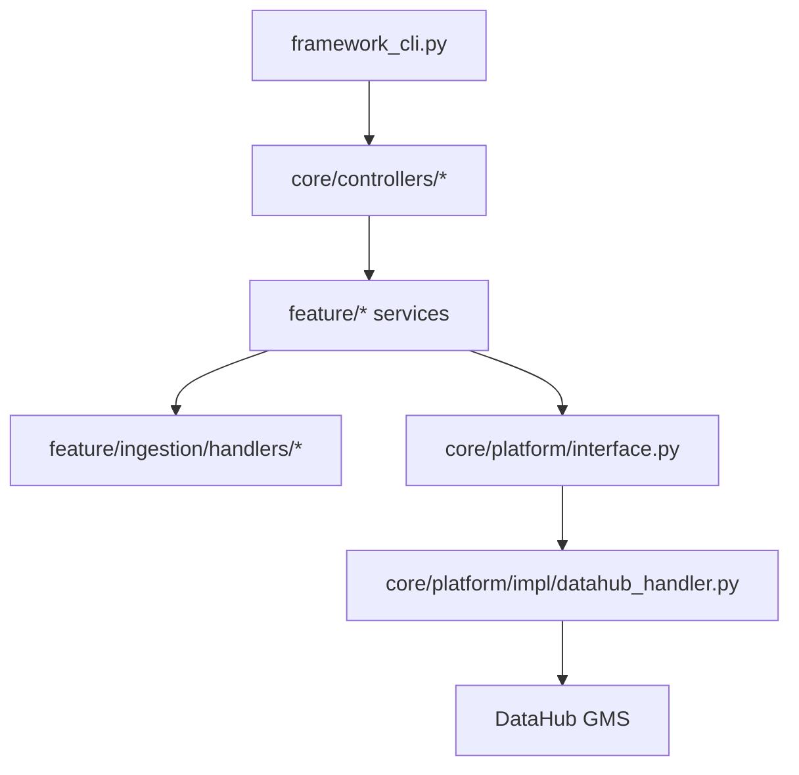

# Lumos Architecture (Today + Direction)

This repo is a modular Python framework that integrates with DataHub via a platform adapter. The planned direction introduces a Spring Boot "control plane" for orchestration while keeping Python workers for file/format-heavy ingestion and extraction.

## Today: Python Framework (CLI-Orchestrated)

**Execution path**
- `framework_cli.py` parses operations and calls controllers under `core/controllers/`.
- Controllers initialize feature services under `feature/*`.
- Feature services select source handlers (ingestion) and call the platform adapter via `core/platform/interface.py`.
- `core/platform/impl/datahub_handler.py` talks to DataHub (REST emitter / MCP).

## Key Code Locations

- CLI entrypoint: `framework_cli.py`
- Config loading: `core/common/config_manager.py`
- Controllers (routing/orchestration): `core/controllers/`
- Feature services (business logic): `feature/`
- Ingestion handlers (sources): `feature/ingestion/handlers/`
- Platform abstraction + factory: `core/platform/interface.py`, `core/platform/factory.py`
- DataHub adapter: `core/platform/impl/datahub_handler.py`

## Planned: Control Plane + Workers (Spring Boot + Python)

Goal: introduce a reliable orchestration layer (scheduling, retries, auditing, API surface) without re-implementing file/format-heavy ingestion logic.

- Control plane (Spring Boot): job registry, scheduling, retries, audit logs, and API endpoints.
- Queue: Redis Streams for lightweight job dispatch.
- Workers (Python): consume jobs and run ingestion/extraction using existing code paths.

Details and rationale live in `docs/DECISIONS.md`.
