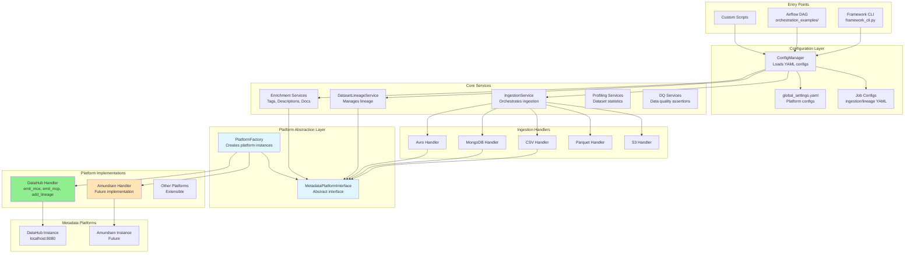

# Lumos Framework - Architecture & End-to-End Flow

## Overview

Lumos is a **platform-agnostic metadata management framework** that provides a unified interface for ingesting, enriching, and managing metadata across different data catalog platforms (DataHub, Amundsen, etc.) and data sources (CSV, MongoDB, Avro, Parquet, S3, etc.).

## Core Design Principles

- **Platform Agnostic**: Abstract interface allows switching between metadata platforms without code changes
- **Extensible**: Easy to add new data sources and platforms via handler pattern
- **Modular**: Clear separation of concerns with dedicated services
- **Configuration-Driven**: YAML-based configuration for all operations

## Architecture Diagram



## End-to-End Flow: Ingestion

### 1. Entry Point
```python
# CLI: python framework_cli.py ingest --config-path config.yaml
# Or: Airflow DAG task
# Or: Custom Python script
```

### 2. Configuration Loading
```python
ConfigManager.load_config(config_path)
  ├─ Loads job config (source type, path, dataset name, etc.)
  └─ Loads global_settings.yaml (platform connection details)
```

### 3. Platform Handler Creation
```python
PlatformFactory.get_instance(platform_name, platform_config)
  ├─ Checks if instance exists (singleton pattern)
  ├─ Creates DataHubHandler / AmundsenHandler / etc.
  └─ Returns MetadataPlatformInterface instance
```

### 4. Ingestion Service Initialization
```python
IngestionService(config_manager, platform_handler)
  ├─ Registers available handlers (CSV, MongoDB, Avro, etc.)
  └─ Ready to process ingestion requests
```

### 5. Handler Selection & Execution
```python
IngestionService.start_ingestion(config_path)
  ├─ Loads config
  ├─ Identifies source type (csv, mongodb, avro, etc.)
  ├─ Selects appropriate handler (CSVIngestionHandler, etc.)
  └─ Calls handler.ingest()
```

### 6. Metadata Extraction & Transformation
```python
CSVIngestionHandler.ingest()
  ├─ Reads CSV file
  ├─ Extracts schema (column names, types)
  ├─ Creates DataHub MCE objects:
  │   ├─ DatasetSnapshot
  │   ├─ SchemaMetadata (fields, types)
  │   └─ DatasetProperties (name, description)
  └─ Calls platform_handler.emit_mce(mce)
```

### 7. Platform-Specific Emission
```python
DataHubHandler.emit_mce(mce)
  ├─ Uses DatahubRestEmitter
  ├─ Sends HTTP request to DataHub GMS (localhost:8080)
  └─ Metadata is now in DataHub!
```

## End-to-End Flow: Lineage

### 1. Entry Point
```python
# CLI: python framework_cli.py add-lineage --config-path lineage_config.yaml
```

### 2. Configuration & Platform Setup
```python
ConfigManager.load_config(lineage_config_path)
PlatformFactory.get_instance("datahub", platform_config)
```

### 3. Lineage Service
```python
DatasetLineageService(platform_handler)
  ├─ Reads lineage config (upstream URNs, downstream URN)
  └─ For each upstream:
      └─ Calls platform_handler.add_lineage(upstream_urn, downstream_urn)
```

### 4. Platform-Specific Lineage
```python
DataHubHandler.add_lineage(upstream_urn, downstream_urn)
  ├─ Creates MetadataChangeProposal (MCP)
  ├─ Wraps in UpstreamLineageClass
  └─ Emits to DataHub via REST API
```

## Component Details

### Core Services

| Service | Responsibility | Location |
|---------|---------------|----------|
| **IngestionService** | Orchestrates data source ingestion | `core_library/ingestion_handlers/ingestion_service.py` |
| **DatasetLineageService** | Manages dataset lineage relationships | `core_library/lineage_services/dataset_lineage_service.py` |
| **DescriptionService** | Adds descriptions to datasets/fields | `core_library/enrichment_services/description_service.py` |
| **TagService** | Adds tags to datasets | `core_library/enrichment_services/tag_service.py` |
| **PropertiesService** | Updates dataset properties | `core_library/enrichment_services/properties_service.py` |
| **DatasetStatsService** | Generates dataset statistics | `core_library/profiling_services/dataset_stats_service.py` |

### Ingestion Handlers

| Handler | Source Type | Location |
|---------|-------------|----------|
| **CSVIngestionHandler** | CSV files | `core_library/ingestion_handlers/csv_handler.py` |
| **MongoIngestionHandler** | MongoDB collections | `core_library/ingestion_handlers/mongo_handler.py` |
| **AvroIngestionHandler** | Avro files | `core_library/ingestion_handlers/avro_handler.py` |
| **ParquetIngestionHandler** | Parquet files | `core_library/ingestion_handlers/parquet_handler.py` |
| **S3Handler** | S3 objects | `core_library/ingestion_handlers/s3_handler.py` |

### Platform Abstraction

- **MetadataPlatformInterface**: Abstract base class defining platform contract
  - `emit_mce(mce)` - Emit Metadata Change Event
  - `emit_mcp(mcp)` - Emit Metadata Change Proposal
  - `add_lineage(upstream_urn, downstream_urn)` - Add lineage relationship

- **PlatformFactory**: Factory pattern for creating platform instances
  - Singleton pattern (one instance per platform)
  - Registry-based (easy to add new platforms)

### Platform Implementations

| Platform | Handler | Status |
|----------|---------|--------|
| **DataHub** | `DataHubHandler` | ✅ Implemented |
| **Amundsen** | `AmundsenHandler` | 🔜 Future |
| **Other** | Extensible | 🔜 Future |

## Adding New Components

### Adding a New Data Source

1. Create handler class extending `BaseIngestionHandler`
2. Implement `ingest()` method
3. Register in `IngestionService._handler_registry`
4. Create ingestion config template

### Adding a New Platform

1. Create handler class implementing `MetadataPlatformInterface`
2. Implement `emit_mce()`, `emit_mcp()`, `add_lineage()`
3. Register in `PlatformFactory._handler_registry`
4. Add platform config to `global_settings.yaml`

## Configuration Structure

### Global Settings (`configs/global_settings.yaml`)
```yaml
datahub:
  gms_server: http://localhost:8080
default_env: DEV
```

### Ingestion Config (`sample_configs_and_templates/ingestion/csv_ingestion_template.yaml`)
```yaml
source:
  type: csv
  path: "/path/to/file.csv"
  dataset_name: "my_dataset"
  delimiter: ","
sink:
  type: datahub
  env: DEV
```

### Lineage Config (`sample_configs_and_templates/lineage/dataset_lineage_template.yaml`)
```yaml
lineage:
  downstream: "urn:li:dataset:(csv,downstream_ds,DEV)"
  upstreams:
    - urn: "urn:li:dataset:(csv,upstream_ds,DEV)"
```

## Benefits of Platform-Agnostic Design

1. **Flexibility**: Switch between DataHub, Amundsen, or other platforms via config
2. **Vendor Independence**: Not locked into a single metadata platform
3. **Easy Testing**: Mock platform interface for unit tests
4. **Extensibility**: Add new platforms without changing core logic
5. **Consistency**: Same API for all platforms

