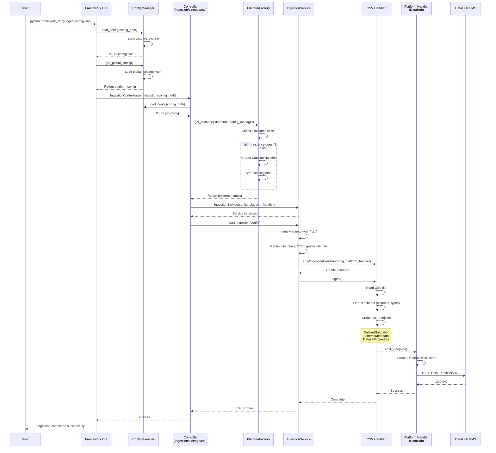
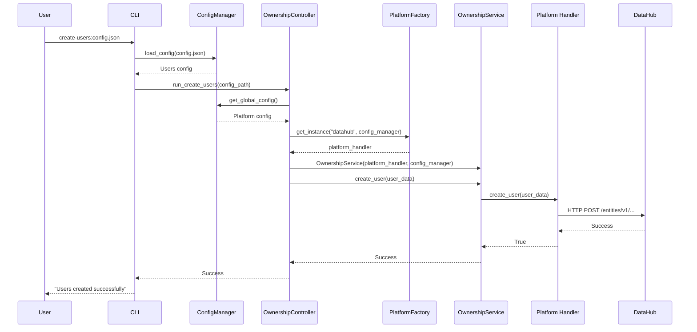
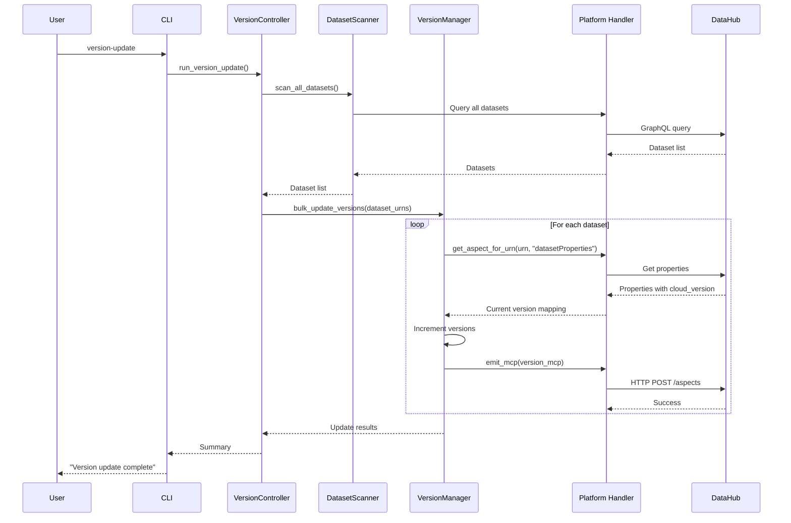
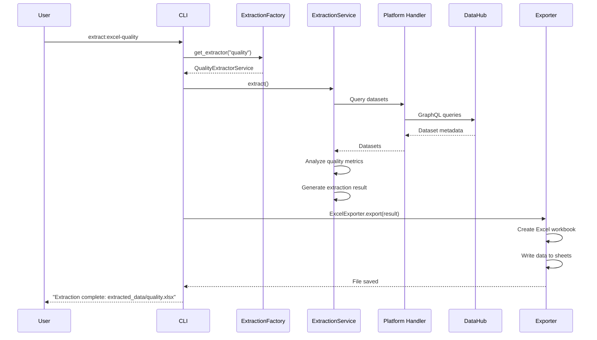

# End-to-End Flow Documentation

## Complete Flow Diagram



## Detailed Step-by-Step Flow

### Phase 1: Initialization

```
1. User invokes CLI
   └─ Command: python framework_cli.py ingest:config.json

2. CLI parses arguments
   ├─ Splits operation:config_path
   ├─ Identifies operation type (ingest, enrich, lineage, etc.)
   └─ Routes to appropriate controller

3. Controller initialization
   ├─ ConfigManager.load_config(config_path)
   │   └─ Parses JSON/YAML: source type, path, dataset name, sink config
   └─ ConfigManager.get_global_config()
       └─ Loads global_settings.yaml: platform connection details

4. Platform handler creation
   ├─ PlatformFactory.get_instance("datahub", config_manager)
   ├─ Checks singleton cache
   ├─ Creates DataHubHandler if not exists
   │   ├─ Initializes DatahubRestEmitter
   │   └─ Connects to GMS server (http://localhost:8080)
   └─ Returns MetadataPlatformInterface instance
```

### Phase 2: Service Orchestration

```
5. Feature service setup
   ├─ IngestionService(config, platform_handler)
   ├─ Registers available handlers:
   │   ├─ "csv" → CSVIngestionHandler
   │   ├─ "mongodb" → MongoIngestionHandler
   │   ├─ "avro" → AvroIngestionHandler
   │   └─ ...
   └─ Ready to process requests

6. Handler selection
   ├─ IngestionService.start_ingestion(config)
   ├─ Loads job configuration
   ├─ Extracts source type: config["source_type"]
   ├─ Looks up handler in factory
   └─ Instantiates appropriate handler
```

### Phase 3: Metadata Extraction

```
7. Source-specific processing (CSV example)
   ├─ CSVIngestionHandler.ingest()
   ├─ Validates configuration
   ├─ Reads CSV file using pandas
   ├─ Extracts schema:
   │   ├─ Column names
   │   ├─ Data types (int64, float64, object)
   │   └─ Type mapping to DataHub types
   └─ Creates metadata objects:
       ├─ SchemaFieldClass for each column
       ├─ SchemaMetadataClass (complete schema)
       ├─ DatasetPropertiesClass (name, description)
       └─ DatasetSnapshotClass (combines all aspects)
```

### Phase 4: Platform Emission

```
8. Metadata transformation
   ├─ Creates MetadataChangeEventClass (MCE)
   ├─ Wraps DatasetSnapshot in MCE
   └─ Generates URN: urn:li:dataset:(csv,dataset_name,DEV)

9. Platform-specific emission
   ├─ Handler calls: platform_handler.emit_mce(mce)
   ├─ DataHubHandler.emit_mce(mce)
   │   ├─ Uses DatahubRestEmitter
   │   ├─ Serializes MCE to JSON
   │   └─ HTTP POST to DataHub GMS API
   └─ Platform receives and stores metadata
```

### Phase 5: Completion

```
10. Success handling
    ├─ Platform returns success response
    ├─ Handler logs success
    ├─ IngestionService returns True
    ├─ Controller logs success
    └─ CLI displays success message

11. Error handling
    ├─ Any exception caught at handler level
    ├─ Logged with context
    ├─ Service returns False
    ├─ Controller handles error
    └─ CLI displays error message
```

## Ownership Flow



## Versioning Flow



## Extraction Flow



## Key Design Patterns

### 1. Factory Pattern
- **PlatformFactory**: Creates platform handler instances
- **Handler Factory**: Maps source types to handler classes
- **ExtractionFactory**: Maps extraction types to extractor services
- **EnrichmentFactory**: Maps enrichment types to enrichment services
- **Singleton**: One instance per platform

### 2. Strategy Pattern
- **Ingestion Handlers**: Different strategies for different source types
- **Platform Handlers**: Different strategies for different platforms
- **Extraction Services**: Different strategies for different extraction types

### 3. Controller Pattern
- **Controllers**: Act as CLI interface layer
- **Separation**: Controllers orchestrate, services implement logic
- **Validation**: Controllers validate configs before passing to services

### 4. Dependency Inversion
- **High-level services** depend on `MetadataPlatformInterface` abstraction
- **Concrete implementations** (DataHubHandler) implement the interface
- **Easy to swap** platforms without changing core logic

### 5. Template Method
- **BaseIngestionHandler**: Defines skeleton of ingestion algorithm
- **Concrete handlers**: Implement specific steps (CSV, MongoDB, etc.)

## Data Flow Summary

```
YAML/JSON Config
    ↓
ConfigManager
    ↓
Controller (CLI Layer)
    ↓
Feature Service (Business Logic)
    ↓
Source Handler / Extraction Service
    ↓
Metadata Objects (MCE/MCP)
    ↓
Platform Handler (DataHub/Amundsen)
    ↓
Metadata Platform (REST API)
    ↓
Metadata Stored ✓
```

## Platform Agnostic Benefits

1. **Same code** works with DataHub, Amundsen, or any platform
2. **Configuration-driven** platform selection
3. **Easy testing** with mock platform handlers
4. **Future-proof** - add new platforms without code changes
5. **Vendor independence** - not locked into one platform

