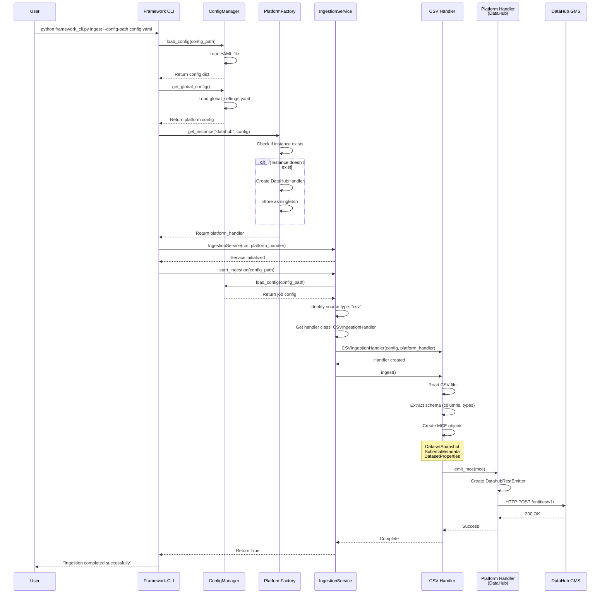
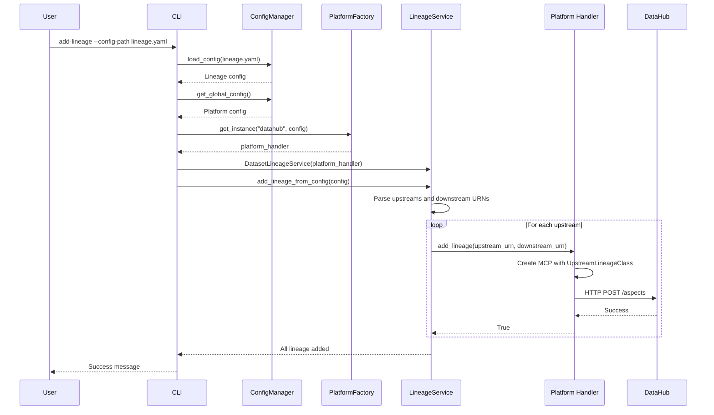

# End-to-End Flow Documentation

## Complete Flow Diagram



## Detailed Step-by-Step Flow

### Phase 1: Initialization

```
1. User invokes CLI
   └─ Command: python framework_cli.py ingest --config-path config.yaml

2. CLI loads configuration
   ├─ ConfigManager.load_config(config_path)
   │   └─ Parses YAML: source type, path, dataset name, sink config
   └─ ConfigManager.get_global_config()
       └─ Loads global_settings.yaml: platform connection details

3. Platform handler creation
   ├─ PlatformFactory.get_instance("datahub", platform_config)
   ├─ Checks singleton cache
   ├─ Creates DataHubHandler if not exists
   │   ├─ Initializes DatahubRestEmitter
   │   └─ Connects to GMS server (http://localhost:8080)
   └─ Returns MetadataPlatformInterface instance
```

### Phase 2: Ingestion Orchestration

```
4. Ingestion service setup
   ├─ IngestionService(config_manager, platform_handler)
   ├─ Registers available handlers:
   │   ├─ "csv" → CSVIngestionHandler
   │   ├─ "mongodb" → MongoIngestionHandler
   │   ├─ "avro" → AvroIngestionHandler
   │   └─ ...
   └─ Ready to process requests

5. Handler selection
   ├─ IngestionService.start_ingestion(config_path)
   ├─ Loads job configuration
   ├─ Extracts source type: config["source"]["type"]
   ├─ Looks up handler in registry
   └─ Instantiates appropriate handler
```

### Phase 3: Metadata Extraction

```
6. Source-specific processing (CSV example)
   ├─ CSVIngestionHandler.ingest()
   ├─ Validates configuration
   ├─ Reads CSV file using pandas
   ├─ Extracts schema:
   │   ├─ Column names
   │   ├─ Data types (int64, float64, object)
   │   └─ Type mapping to DataHub types
   └─ Creates metadata objects:
       ├─ SchemaFieldClass for each column
       ├─ SchemaMetadataClass (complete schema)
       ├─ DatasetPropertiesClass (name, description)
       └─ DatasetSnapshotClass (combines all aspects)
```

### Phase 4: Platform Emission

```
7. Metadata transformation
   ├─ Creates MetadataChangeEventClass (MCE)
   ├─ Wraps DatasetSnapshot in MCE
   └─ Generates URN: urn:li:dataset:(csv,dataset_name,DEV)

8. Platform-specific emission
   ├─ Handler calls: platform_handler.emit_mce(mce)
   ├─ DataHubHandler.emit_mce(mce)
   │   ├─ Uses DatahubRestEmitter
   │   ├─ Serializes MCE to JSON
   │   └─ HTTP POST to DataHub GMS API
   └─ Platform receives and stores metadata
```

### Phase 5: Completion

```
9. Success handling
   ├─ Platform returns success response
   ├─ Handler logs success
   ├─ IngestionService returns True
   └─ CLI displays success message

10. Error handling
    ├─ Any exception caught at handler level
    ├─ Logged with context
    ├─ IngestionService returns False
    └─ CLI displays error message
```

## Lineage Flow



## Key Design Patterns

### 1. Factory Pattern
- **PlatformFactory**: Creates platform handler instances
- **Handler Registry**: Maps platform names to handler classes
- **Singleton**: One instance per platform

### 2. Strategy Pattern
- **Ingestion Handlers**: Different strategies for different source types
- **Platform Handlers**: Different strategies for different platforms

### 3. Dependency Inversion
- **High-level services** depend on `MetadataPlatformInterface` abstraction
- **Concrete implementations** (DataHubHandler) implement the interface
- **Easy to swap** platforms without changing core logic

### 4. Template Method
- **BaseIngestionHandler**: Defines skeleton of ingestion algorithm
- **Concrete handlers**: Implement specific steps (CSV, MongoDB, etc.)

## Data Flow Summary

```
YAML Config
    ↓
ConfigManager
    ↓
IngestionService
    ↓
Source Handler (CSV/MongoDB/Avro)
    ↓
Metadata Objects (MCE/MCP)
    ↓
Platform Handler (DataHub/Amundsen)
    ↓
Metadata Platform (REST API)
    ↓
Metadata Stored ✓
```

## Platform Agnostic Benefits

1. **Same code** works with DataHub, Amundsen, or any platform
2. **Configuration-driven** platform selection
3. **Easy testing** with mock platform handlers
4. **Future-proof** - add new platforms without code changes
5. **Vendor independence** - not locked into one platform

