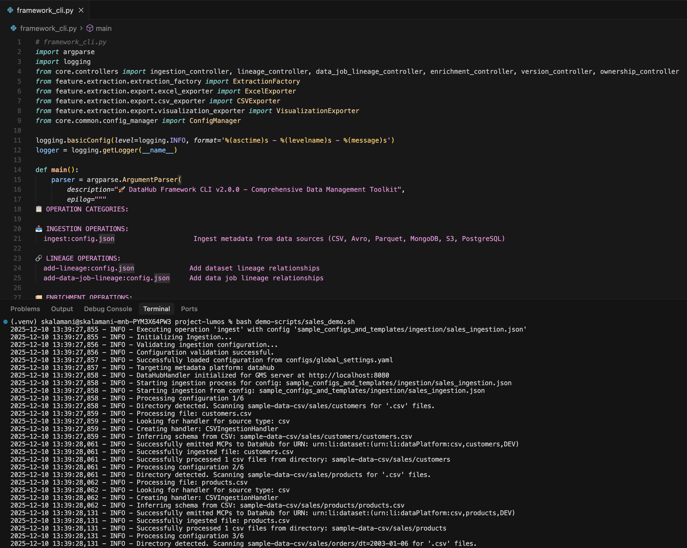
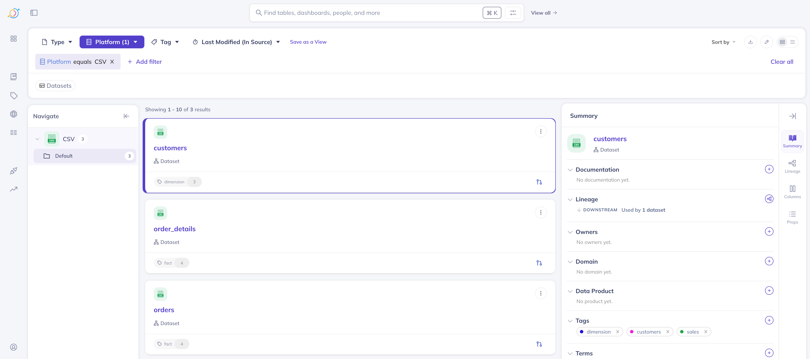
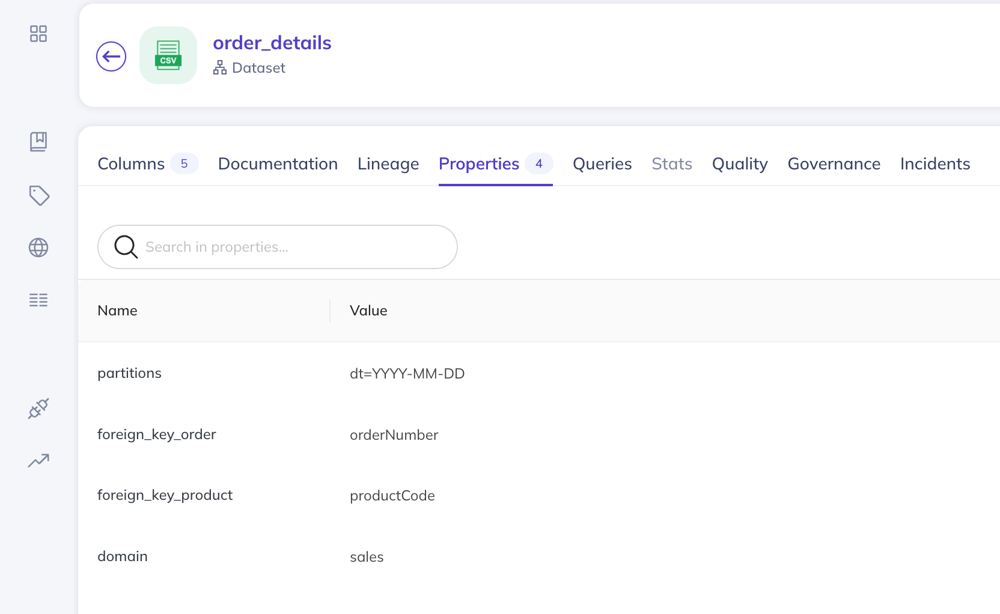
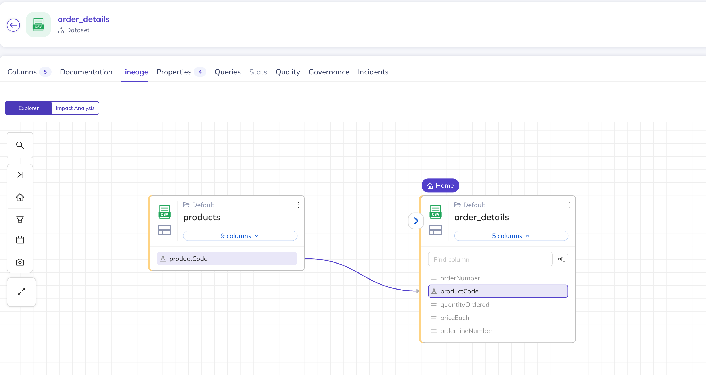

# LUMOS End-to-End Workflow Demonstration

This document provides a senior-level, production‑grade walkthrough of the **LUMOS → DataHub** integration pipeline. It outlines the complete operational flow—from platform initialization to metadata ingestion, dataset registration, and lineage visualization inside DataHub. The goal is to give stakeholders and reviewers a clear, concise, and technically accurate representation of how LUMOS automates metadata management.

---

## 1. DataHub Platform Initialization (Docker Quickstart)

The workflow begins by provisioning a local DataHub environment using the official Docker quickstart. This sets up all dependent services including GMS, MySQL, Elasticsearch, UI, Kafka, and supporting components.

```bash
DATAHUB_VERSION=v1.2.0 datahub docker quickstart --version v1.2.0
```

The CLI automatically detects system architecture, pulls the appropriate container images, and generates a working compose configuration.

**Screenshot:** DataHub Docker Quickstart output


---

## 2. Executing Metadata Ingestion via LUMOS (sales_demo.sh)

Once the DataHub environment is operational, ingestion is initiated using the LUMOS framework CLI. The demo script `sales_demo.sh` triggers the following sequence:

* Configuration loading and validation
* Extraction of metadata from CSV sample datasets
* Generation of DataHub MCP (Metadata Change Proposal) events
* Publishing metadata to DataHub through the GMS API

```bash
bash demo-scripts/sales_demo.sh
```

**Screenshot:** LUMOS Ingestion Workflow Execution (sample of logs, dataset extraction, MCP emission)



---

## 3. Dataset Registration in DataHub UI

After ingestion completes successfully, the CSV datasets become visible in DataHub. The demo includes three core datasets under the `CSV` platform:

* `customers`
* `orders`
* `order_details`

These datasets are automatically tagged, typed, and linked according to the ingestion configuration.

**Screenshot:** DataHub UI – Registered Datasets



---

## 4. Dataset Enrichment (Documentation, Tags, Properties)

Dataset enrichment in LUMOS is **not automatic**—it is explicitly defined through enrichment configuration templates. These templates allow teams to add structured metadata beyond what is inferred from the physical dataset.

Enrichment configuration supports:

* **Business Documentation** – High‑level dataset purpose, usage guidelines, semantics
* **Column-Level Descriptions** – Field definitions, semantics, domain constraints
* **Tags & Domains** – Helps classification, access management, and discovery
* **Custom Properties** – Partitioning rules, foreign key definitions, operational attributes

For example, the `order_details` dataset enrichment file defines:

* `partitions` → `dt=YYYY-MM-DD`
* `foreign_key_order` → `orderNumber`
* `foreign_key_product` → `productCode`
* `domain` → `sales`
* Additional documentation and tags applied through enrichment templates

These enrichment templates must be provided and maintained as part of the ingestion workflow.

**Screenshot:** DataHub UI – Dataset Properties & Enrichment



---

## 5. Configured Data Lineage Construction

Data lineage in LUMOS is **not inferred automatically**. It is defined through lineage configuration templates, where engineers explicitly specify upstream and downstream relationships.

The lineage templates allow defining:

* Dataset‑level lineage (relationships between tables)
* Column‑level lineage (mapping source → target fields)
* Cross‑domain or cross‑platform lineage connections

In this demo, lineage is configured so that:

* `order_details.productCode` maps to `products.productCode`
* Additional lineage mapping can be added through configuration files

The lineage controller consumes these templates to generate MCPs that produce the graph visible in DataHub.

**Screenshot:** DataHub UI – Lineage Explorer



---

## Summary

This end‑to‑end demonstration validates the LUMOS framework’s ability to:

* Provision a DataHub metadata platform
* Extract, structure, and publish dataset metadata
* Enrich datasets with domain‑specific properties
* Construct accurate lineage relationships
* Provide a complete and navigable metadata experience within the DataHub UI

This workflow can serve as a baseline for more advanced ingestion scenarios (e.g., Avro, Parquet, S3, RDBMS sources) as well as custom lineage and governance enhancements.

