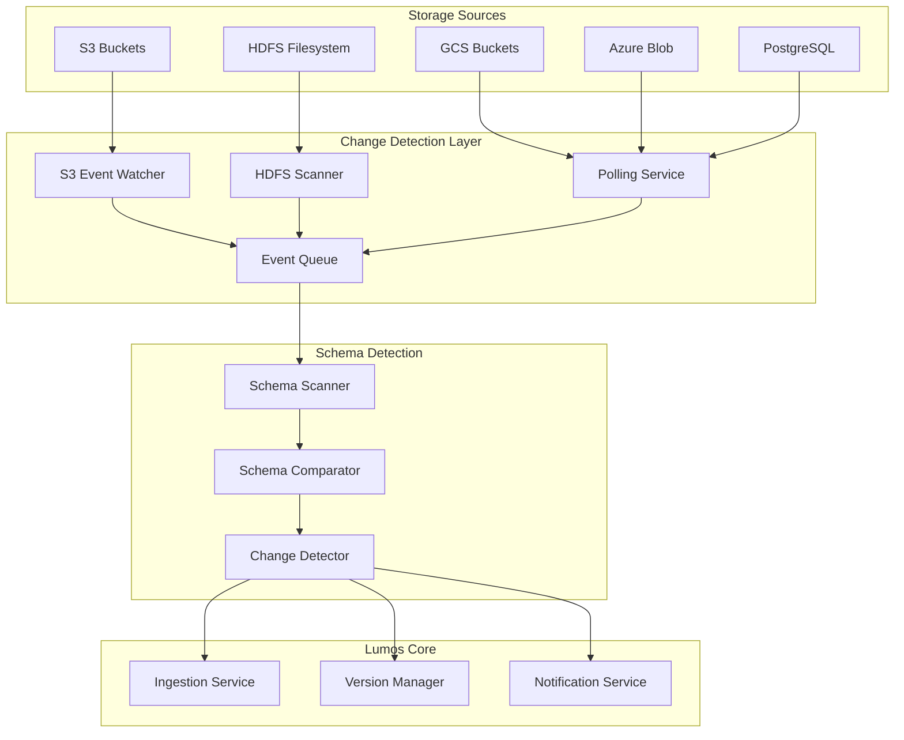
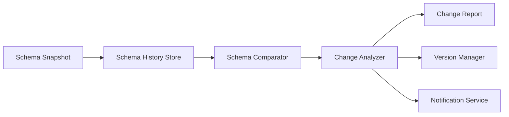
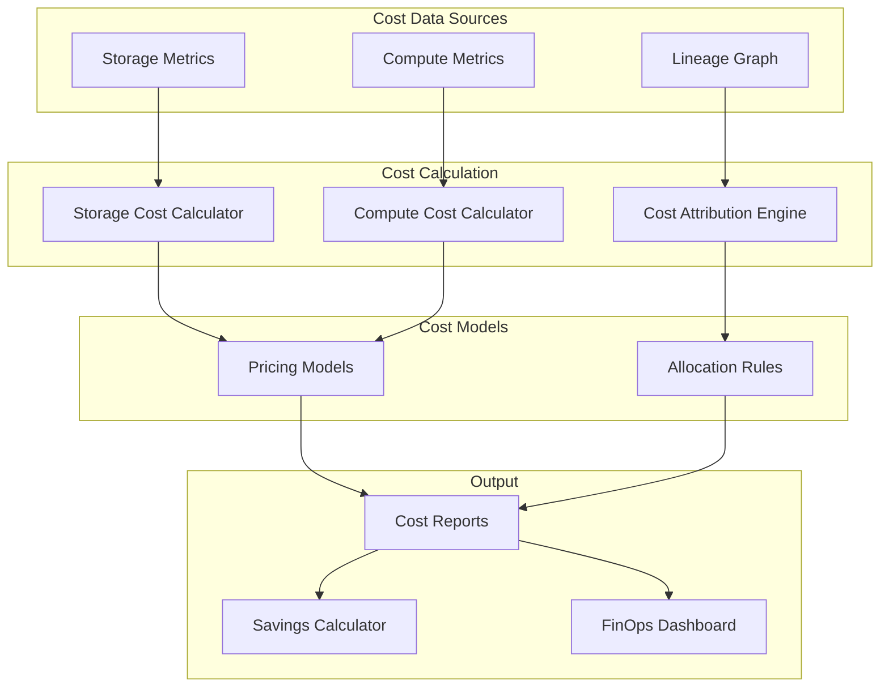
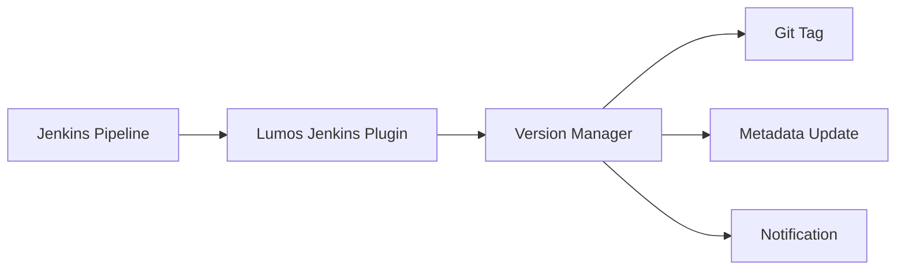

# Lumos Complete Vision - Detailed Technical Implementation Plan

## Executive Summary

This document provides a comprehensive technical plan for evolving Lumos from a metadata management framework into the industry's first **platform-agnostic, cost-aware, automatically-detecting metadata management platform**. The plan addresses 5 critical industry-wide problems that no existing solution fully solves.

**Timeline:** Illustrative sequencing only (no commitments)  
**Priority:** P0 features (automatic detection, cost calculation, schema tracking) are critical for market differentiation

---

## Table of Contents

1. [Current State Assessment](#current-state-assessment)
2. [Vision & Problems Solved](#vision--problems-solved)
3. [Phase 1: Automatic Change Detection](#phase-1-automatic-change-detection-cdc)
4. [Phase 2: Schema Change Tracking](#phase-2-schema-change-tracking)
5. [Phase 3: Cost Calculation & FinOps](#phase-3-cost-calculation--finops)
6. [Phase 4: Snapshot Format & Portability](#phase-4-snapshot-format--portability)
7. [Phase 5: Jenkins Integration](#phase-5-jenkins-integration)
8. [Phase 6: Cross-Platform Connectors](#phase-6-cross-platform-connectors)
9. [Phase 7: Documentation & README](#phase-7-documentation--readme)
10. [Testing Strategy](#testing-strategy)
11. [Migration Path](#migration-path)
12. [Success Metrics](#success-metrics)

---

## Current State Assessment

### Existing Components (Solid Foundation)

| Component | Location | Status | Completeness |
|-----------|----------|--------|--------------|
| Platform Abstraction | `core/platform/interface.py` | [ok] Complete | 100% - Clean interface design |
| Platform Factory | `core/platform/factory.py` | [ok] Complete | 100% - Singleton pattern |
| DataHub Handler | `core/platform/impl/datahub_handler.py` | [ok] Complete | 100% - Full integration |
| Ingestion Service | `feature/ingestion/ingestion_service.py` | [ok] Complete | 100% - Multi-source support |
| Base Handler | `feature/ingestion/handlers/base_ingestion_handler.py` | [ok] Complete | 100% - SOLID design |
| 6 Source Handlers | `feature/ingestion/handlers/` | [ok] Complete | CSV, Avro, Parquet, MongoDB, S3, PostgreSQL |
| Version Manager | `feature/versioning/version_service.py` | [ok] Complete | Cloud + schema versioning |
| Lineage Service | `feature/lineage/dataset_lineage_service.py` | [ok] Complete | Dataset + column lineage |
| 11 Extractors | `feature/extraction/` | [ok] Complete | Comprehensive coverage |
| Ownership Service | `feature/ownership/ownership_service.py` | [ok] Complete | Users, groups, assignments |

### Critical Gaps Identified

| Gap | Impact | Priority | Effort | Business Value |
|-----|--------|----------|--------|----------------|
| **Automatic Change Detection** | Core value prop - "never dependent on developer" | P0 | 3 weeks | ***** |
| **Schema Change Tracking** | Real historical tracking vs simulation | P0 | 2 weeks | ***** |
| **Cost Calculation** | FinOps capability - major differentiator | P0 | 2 weeks | ***** |
| **Snapshot Format** | Vendor portability - key selling point | P0 | 1 week | ***** |
| **Jenkins Integration** | CI/CD automation | P1 | 1 week | **** |
| **Cross-Platform Connectors** | Multi-cloud support | P1 | 4 weeks | **** |
| **Real-time Sync** | Event-driven updates | P2 | 2 weeks | *** |
| **Governance Dashboard** | Visibility layer | P2 | 2 weeks | *** |

---

## Vision & Problems Solved

### The 5 Industry-Wide Problems

#### Problem 1: Storage-Based Data Versioning
**Current State:** No solution tracks versions for data in S3/HDFS storage  
**Why It Matters:** Data pipelines write to storage, but there's no way to version or assess this data  
**Lumos Solution:** Automatic version tracking with cloud version (S-311 -> S-312) and schema version (1.0.0 -> 2.0.0)

#### Problem 2: Automatic Schema Change Detection
**Current State:** Developers can't manually track every schema change in fast-moving companies  
**Why It Matters:** Schema changes happen constantly, tracking becomes impossible  
**Lumos Solution:** Automatic detection from storage, no developer intervention required

#### Problem 3: Cost Attribution & FinOps
**Current State:** Impossible to calculate cost of output datasets or savings from feature shutdowns  
**Why It Matters:** Companies waste millions on unused data, but can't identify what to turn off  
**Lumos Solution:** Cost calculation via lineage, storage + compute costs, feature shutdown savings calculator

#### Problem 4: Cross-Platform Integration
**Current State:** Each service (Snowflake, BigQuery) has its own catalog, no unified view  
**Why It Matters:** Organizations use multiple platforms, metadata is fragmented  
**Lumos Solution:** Platform-agnostic abstraction, works with DataHub, Amundsen, Snowflake, BigQuery, etc.

#### Problem 5: Vendor Lock-In
**Current State:** Metadata trapped in proprietary formats, migration is impossible  
**Why It Matters:** Companies pay premium prices or can't switch vendors  
**Lumos Solution:** Lumos-native snapshot format, migrate between platforms without rewriting code

---

## Phase 1: Automatic Change Detection (CDC)

### Architecture



### File Structure

```
feature/detection/
+-- __init__.py
+-- change_detection_service.py      # Main orchestrator
+-- storage_watcher.py               # Abstract base for watchers
+-- s3_watcher.py                    # S3 event-based watcher
+-- hdfs_scanner.py                  # HDFS filesystem scanner
+-- polling_service.py                # Polling-based detection
+-- schema_scanner.py                 # Automatic schema extraction
+-- schema_comparator.py              # Compare schema versions
+-- change_detector.py                # Detect and classify changes

core/storage/
+-- __init__.py
+-- schema_history_store.py          # Store historical schemas
+-- change_event_store.py             # Store change events
```

### Implementation Details

#### 1. ChangeDetectionService (`feature/detection/change_detection_service.py`)

**Purpose:** Main orchestrator for automatic change detection

**Key Methods:**
```python
class ChangeDetectionService:
    def __init__(self, config_manager: ConfigManager, 
                 platform_handler: MetadataPlatformInterface):
        """Initialize with config and platform handler"""
        self.config_manager = config_manager
        self.platform_handler = platform_handler
        self.watchers = []
        self.schema_history_store = SchemaHistoryStore(config_manager)
        
    def start_monitoring(self, sources: List[Dict[str, Any]]) -> None:
        """Start monitoring specified data sources"""
        for source_config in sources:
            watcher = self._create_watcher(source_config)
            watcher.start()
            self.watchers.append(watcher)
        
    def stop_monitoring(self) -> None:
        """Stop all monitoring"""
        for watcher in self.watchers:
            watcher.stop()
            
    def register_change_handler(self, handler: Callable) -> None:
        """Register callback for change events"""
        self.change_handlers.append(handler)
        
    def get_change_history(self, dataset_urn: str, 
                          limit: int = 100) -> List[ChangeEvent]:
        """Get change history for a dataset"""
        return self.schema_history_store.get_change_history(
            dataset_urn, limit
        )
```

**Configuration Format:**
```yaml
change_detection:
  enabled: true
  sources:
    - type: s3
      bucket: my-data-bucket
      prefix: datasets/
      watch_mode: events  # events, polling, or hybrid
      polling_interval: 300  # seconds
      event_types: [ObjectCreated, ObjectDeleted]
      sqs_queue: arn:aws:sqs:...
    - type: hdfs
      path: /data/lake
      recursive: true
      polling_interval: 600
    - type: postgres
      connection_string: postgresql://...
      schemas: [public, analytics]
      watch_tables: true
      polling_interval: 300
```

#### 2. S3Watcher (`feature/detection/s3_watcher.py`)

**Purpose:** S3-specific change detection using S3 events

**Implementation:**
```python
class S3Watcher(StorageWatcher):
    def __init__(self, config: Dict[str, Any]):
        self.bucket = config['bucket']
        self.prefix = config.get('prefix', '')
        self.s3_client = boto3.client('s3')
        self.sqs_client = boto3.client('sqs')
        self.queue_url = config.get('sqs_queue') or self._setup_s3_event_queue()
        self.running = False
    
    def _setup_s3_event_queue(self) -> str:
        """Create SQS queue and configure S3 bucket notifications"""
        # 1. Create SQS queue
        queue_response = self.sqs_client.create_queue(
            QueueName=f'lumos-s3-events-{self.bucket}'
        )
        queue_url = queue_response['QueueUrl']
        
        # 2. Configure S3 bucket to send events to queue
        self.s3_client.put_bucket_notification_configuration(
            Bucket=self.bucket,
            NotificationConfiguration={
                'QueueConfigurations': [{
                    'QueueArn': queue_url,
                    'Events': ['s3:ObjectCreated:*', 's3:ObjectDeleted:*']
                }]
            }
        )
        
        return queue_url
    
    def watch(self) -> Iterator[ChangeEvent]:
        """Poll SQS queue for S3 events and yield ChangeEvents"""
        self.running = True
        while self.running:
            messages = self.sqs_client.receive_message(
                QueueUrl=self.queue_url,
                MaxNumberOfMessages=10,
                WaitTimeSeconds=20
            )
            
            for msg in messages.get('Messages', []):
                event = self._parse_s3_event(msg['Body'])
                if self._is_relevant(event):
                    change_event = self._create_change_event(event)
                    yield change_event
                    self.sqs_client.delete_message(
                        QueueUrl=self.queue_url,
                        ReceiptHandle=msg['ReceiptHandle']
                    )
```

**ChangeEvent Model:**
```python
@dataclass
class ChangeEvent:
    event_id: str
    dataset_urn: str
    event_type: str  # CREATED, DELETED, MODIFIED, SCHEMA_CHANGED
    timestamp: datetime
    source_path: str
    old_schema: Optional[Dict] = None
    new_schema: Optional[Dict] = None
    change_summary: Optional[Dict] = None
    metadata: Dict[str, Any] = None
```

#### 3. SchemaScanner (`feature/detection/schema_scanner.py`)

**Purpose:** Automatically extract schema from storage files

**Implementation:**
```python
class SchemaScanner:
    def __init__(self, config_manager: ConfigManager):
        self.config_manager = config_manager
        # Reuse existing ingestion handlers
        from feature.ingestion.handlers.factory import HandlerFactory
        self.handler_factory = HandlerFactory
    
    def scan_schema(self, source_path: str, source_type: str) -> Dict[str, Any]:
        """Extract schema from file/database"""
        # Create temporary config for handler
        config = {
            'source': {
                'source_path': source_path,
                'source_type': source_type,
                'infer_schema': True
            },
            'sink': {}
        }
        
        handler = self.handler_factory.get_handler(config)
        schema_fields = handler._get_schema_fields()
        
        return {
            'fields': [
                {
                    'name': field.fieldPath,
                    'type': str(field.type.type),
                    'nullable': field.nullable
                }
                for field in schema_fields
            ],
            'field_count': len(schema_fields)
        }
```

#### 4. SchemaComparator (`feature/detection/schema_comparator.py`)

**Purpose:** Compare two schema versions and detect changes

**Implementation:**
```python
class SchemaComparator:
    def compare(self, old_schema: Dict, new_schema: Dict) -> SchemaDiff:
        """Compare schemas and return diff"""
        old_fields = {f['name']: f for f in old_schema.get('fields', [])}
        new_fields = {f['name']: f for f in new_schema.get('fields', [])}
        
        added = [name for name in new_fields if name not in old_fields]
        removed = [name for name in old_fields if name not in new_fields]
        modified = []
        type_changes = []
        
        for name in set(old_fields.keys()) & set(new_fields.keys()):
            old_field = old_fields[name]
            new_field = new_fields[name]
            
            if old_field['type'] != new_field['type']:
                type_changes.append(TypeChange(
                    field_name=name,
                    old_type=old_field['type'],
                    new_type=new_field['type'],
                    breaking=self._is_breaking_type_change(
                        old_field['type'], new_field['type']
                    )
                ))
            
            if (old_field.get('nullable') != new_field.get('nullable') or
                old_field.get('default') != new_field.get('default')):
                modified.append(FieldModification(
                    field_name=name,
                    old_nullable=old_field.get('nullable', False),
                    new_nullable=new_field.get('nullable', False),
                    old_default=old_field.get('default'),
                    new_default=new_field.get('default')
                ))
        
        return SchemaDiff(
            added_fields=added,
            removed_fields=removed,
            modified_fields=modified,
            type_changes=type_changes,
            has_changes=bool(added or removed or modified or type_changes),
            has_breaking_changes=any(tc.breaking for tc in type_changes) or bool(removed)
        )
    
    def _is_breaking_type_change(self, old_type: str, new_type: str) -> bool:
        """Determine if type change is breaking"""
        # String -> int: breaking
        # int -> long: non-breaking
        # etc.
        breaking_changes = {
            ('string', 'int'), ('string', 'float'),
            ('int', 'string'), ('float', 'string')
        }
        return (old_type, new_type) in breaking_changes
```

**SchemaDiff Model:**
```python
@dataclass
class SchemaDiff:
    added_fields: List[str]
    removed_fields: List[str]
    modified_fields: List[FieldModification]
    type_changes: List[TypeChange]
    has_changes: bool
    has_breaking_changes: bool

@dataclass
class FieldModification:
    field_name: str
    old_nullable: bool
    new_nullable: bool
    old_default: Any
    new_default: Any

@dataclass
class TypeChange:
    field_name: str
    old_type: str
    new_type: str
    breaking: bool
```

#### 5. SchemaHistoryStore (`core/storage/schema_history_store.py`)

**Purpose:** Store historical schema versions for comparison

**Implementation:**
```python
class SchemaHistoryStore:
    def __init__(self, config_manager: ConfigManager):
        self.config_manager = config_manager
        self.storage_backend = self._init_storage_backend()
    
    def _init_storage_backend(self):
        """Initialize storage backend (SQLite, PostgreSQL, or file-based)"""
        config = self.config_manager.get_global_config()
        storage_config = config.get('storage', {})
        backend_type = storage_config.get('backend', 'sqlite')
        
        if backend_type == 'sqlite':
            return SQLiteBackend(storage_config.get('path', 'lumos.db'))
        elif backend_type == 'postgres':
            return PostgreSQLBackend(storage_config.get('connection_string'))
        else:
            return FileBackend(storage_config.get('path', 'lumos_snapshots'))
    
    def save_schema_snapshot(self, dataset_urn: str, schema: Dict, 
                            version: str) -> None:
        """Save schema snapshot with version"""
        snapshot = {
            'dataset_urn': dataset_urn,
            'schema': schema,
            'version': version,
            'timestamp': datetime.utcnow().isoformat(),
            'hash': self._compute_schema_hash(schema)
        }
        self.storage_backend.save_snapshot(snapshot)
    
    def get_schema_history(self, dataset_urn: str) -> List[Dict]:
        """Get all schema versions for a dataset"""
        return self.storage_backend.get_history(dataset_urn)
    
    def get_latest_schema(self, dataset_urn: str) -> Optional[Dict]:
        """Get most recent schema version"""
        history = self.get_schema_history(dataset_urn)
        return history[-1] if history else None
    
    def _compute_schema_hash(self, schema: Dict) -> str:
        """Compute hash of schema for change detection"""
        import hashlib
        schema_str = json.dumps(schema, sort_keys=True)
        return hashlib.sha256(schema_str.encode()).hexdigest()
```

### Integration Points

**Modify `feature/ingestion/ingestion_service.py`:**
```python
def start_ingestion(self, config_path: str) -> None:
    # Existing code...
    
    # NEW: Check if change detection is enabled
    global_config = self.config_manager.get_global_config()
    cdc_config = global_config.get('change_detection', {})
    
    if cdc_config.get('enabled', False):
        from feature.detection.change_detection_service import ChangeDetectionService
        change_service = ChangeDetectionService(
            self.config_manager, 
            self.platform_handler
        )
        change_service.start_monitoring([config])
        change_service.register_change_handler(self._handle_change_event)
```

**Modify `feature/versioning/version_service.py`:**
```python
def update_dataset_version(self, dataset_urn: str, dataset_name: str, 
                          change_event: Optional[ChangeEvent] = None) -> VersionUpdateResult:
    # Existing version logic...
    
    # NEW: If change_event provided, use it to determine version bump
    if change_event and change_event.event_type == 'SCHEMA_CHANGED':
        schema_diff = change_event.change_summary
        if schema_diff.has_breaking_changes:
            # Major version bump
            next_schema_version = self.increment_major_version(latest_schema_version)
        elif schema_diff.has_changes:
            # Minor version bump
            next_schema_version = self.increment_minor_version(latest_schema_version)
        else:
            # Patch version bump
            next_schema_version = self.increment_patch_version(latest_schema_version)
    else:
        # Default behavior: increment cloud version
        next_schema_version = self.increment_schema_version(latest_schema_version)
```

---

## Phase 2: Schema Change Tracking

### Architecture



### Implementation

#### SchemaHistoryService (`feature/tracking/schema_history_service.py`)

**Purpose:** Track and analyze schema evolution over time

**Key Methods:**
```python
class SchemaHistoryService:
    def __init__(self, config_manager: ConfigManager):
        self.config_manager = config_manager
        self.history_store = SchemaHistoryStore(config_manager)
        self.comparator = SchemaComparator()
    
    def track_schema_change(self, dataset_urn: str, old_schema: Dict, 
                           new_schema: Dict, change_event: ChangeEvent) -> SchemaChangeRecord:
        """Record a schema change with full context"""
        diff = self.comparator.compare(old_schema, new_schema)
        
        # Get downstream datasets for impact analysis
        from feature.lineage.dataset_lineage_service import DatasetLineageService
        lineage_service = DatasetLineageService(
            self.platform_handler, 
            self.config_manager
        )
        downstream = lineage_service.get_downstream_datasets(dataset_urn)
        
        record = SchemaChangeRecord(
            record_id=str(uuid.uuid4()),
            dataset_urn=dataset_urn,
            timestamp=datetime.utcnow(),
            change_type=self._classify_change_type(diff),
            field_name=None,  # Set if single field change
            old_value=old_schema,
            new_value=new_schema,
            breaking=diff.has_breaking_changes,
            affected_downstream=[d.urn for d in downstream],
            change_event=change_event,
            diff_summary=diff
        )
        
        self.history_store.save_change_record(record)
        return record
        
    def get_schema_timeline(self, dataset_urn: str) -> List[SchemaVersion]:
        """Get chronological schema versions"""
        history = self.history_store.get_schema_history(dataset_urn)
        return [
            SchemaVersion(
                version=v['version'],
                timestamp=v['timestamp'],
                schema=v['schema'],
                changes=self._get_changes_for_version(v)
            )
            for v in history
        ]
        
    def analyze_schema_evolution(self, dataset_urn: str, 
                                 start_date: datetime, 
                                 end_date: datetime) -> EvolutionReport:
        """Analyze schema changes over time period"""
        timeline = self.get_schema_timeline(dataset_urn)
        filtered = [v for v in timeline 
                   if start_date <= v.timestamp <= end_date]
        
        total_changes = sum(len(v.changes) for v in filtered)
        breaking_changes = sum(1 for v in filtered 
                              if any(c.breaking for c in v.changes))
        
        return EvolutionReport(
            dataset_urn=dataset_urn,
            period_start=start_date,
            period_end=end_date,
            total_versions=len(filtered),
            total_changes=total_changes,
            breaking_changes=breaking_changes,
            change_frequency=total_changes / max((end_date - start_date).days, 1),
            timeline=filtered
        )
        
    def predict_breaking_changes(self, proposed_schema: Dict, 
                                current_schema: Dict) -> List[BreakingChange]:
        """Predict if proposed changes would break downstream consumers"""
        diff = self.comparator.compare(current_schema, proposed_schema)
        
        breaking = []
        if diff.has_breaking_changes:
            for type_change in diff.type_changes:
                if type_change.breaking:
                    breaking.append(BreakingChange(
                        field_name=type_change.field_name,
                        change_type='TYPE_CHANGE',
                        old_type=type_change.old_type,
                        new_type=type_change.new_type,
                        impact='High - downstream consumers may fail'
                    ))
            
            for removed_field in diff.removed_fields:
                breaking.append(BreakingChange(
                    field_name=removed_field,
                    change_type='FIELD_REMOVED',
                    impact='High - downstream consumers will lose access to field'
                ))
        
        return breaking
```

**SchemaChangeRecord Model:**
```python
@dataclass
class SchemaChangeRecord:
    record_id: str
    dataset_urn: str
    timestamp: datetime
    change_type: str  # ADD_FIELD, REMOVE_FIELD, MODIFY_FIELD, TYPE_CHANGE
    field_name: Optional[str]
    old_value: Optional[Any]
    new_value: Optional[Any]
    breaking: bool
    affected_downstream: List[str]  # URNs of downstream datasets
    change_event: ChangeEvent
    diff_summary: SchemaDiff
```

**Modify `feature/extraction/metadata_diff_service.py`:**

Replace simulation with real tracking:
```python
def _extract_diff_details(self, datasets, config: Dict[str, Any]) -> Dict[str, Any]:
    """Extract real metadata diff from schema history"""
    from feature.tracking.schema_history_service import SchemaHistoryService
    history_service = SchemaHistoryService(self.config_manager)
    
    evolution_data = []
    for dataset in datasets:
        timeline = history_service.get_schema_timeline(dataset.urn)
        evolution_info = {
            "dataset_urn": dataset.urn,
            "dataset_name": dataset.name,
            "schema_versions": len(timeline),
            "total_changes": sum(len(v.changes) for v in timeline),
            "breaking_changes": sum(1 for v in timeline if v.has_breaking_changes),
            "timeline": [
                {
                    "version": v.version,
                    "timestamp": v.timestamp.isoformat(),
                    "changes": [
                        {
                            "type": c.change_type,
                            "field": c.field_name,
                            "breaking": c.breaking
                        }
                        for c in v.changes
                    ],
                    "field_count": len(v.schema.get('fields', []))
                }
                for v in timeline
            ]
        }
        evolution_data.append(evolution_info)
    
    return {
        "extraction_metadata": {
            "extracted_at": datetime.now().isoformat(),
            "total_datasets": len(datasets),
            "note": "Real schema evolution tracking from Lumos history"
        },
        "dataset_evolution": evolution_data,
        "evolution_summary": {
            "datasets_tracked": len(datasets),
            "total_versions": sum(len(d['timeline']) for d in evolution_data),
            "total_changes": sum(d['total_changes'] for d in evolution_data),
            "breaking_changes": sum(d['breaking_changes'] for d in evolution_data)
        }
    }
```

---

## Phase 3: Cost Calculation & FinOps

### Architecture



### File Structure

```
feature/cost/
+-- __init__.py
+-- cost_calculator_service.py       # Main orchestrator
+-- storage_cost_tracker.py         # Storage cost calculation
+-- compute_cost_tracker.py          # Compute cost calculation
+-- lineage_cost_attribution.py      # Cost via lineage
+-- pricing_models.py                # Pricing configurations
+-- savings_calculator.py            # Feature shutdown savings
+-- cost_models.py                   # Data models

feature/extraction/
+-- cost_extractor_service.py       # New extractor for cost data
```

### Implementation Details

#### 1. CostCalculatorService (`feature/cost/cost_calculator_service.py`)

**Purpose:** Main service for cost calculation

**Key Methods:**
```python
class CostCalculatorService:
    def __init__(self, config_manager: ConfigManager, 
                 platform_handler: MetadataPlatformInterface):
        self.config_manager = config_manager
        self.platform_handler = platform_handler
        self.storage_tracker = StorageCostTracker(config_manager)
        self.compute_tracker = ComputeCostTracker(config_manager)
        self.attribution = LineageCostAttribution(
            config_manager, 
            platform_handler
        )
    
    def calculate_dataset_cost(self, dataset_urn: str, 
                              period: str = 'monthly') -> DatasetCost:
        """Calculate total cost for a dataset including upstream costs"""
        # Get dataset metadata
        dataset_props = self.platform_handler.get_aspect_for_urn(
            dataset_urn, 
            'datasetProperties'
        )
        
        # Calculate storage cost
        size_bytes = self._get_dataset_size(dataset_urn)
        storage_cost = self.storage_tracker.calculate_storage_cost(
            dataset_urn, 
            size_bytes
        )
        
        # Calculate compute cost (from pipelines that produce this dataset)
        compute_cost = self.compute_tracker.calculate_dataset_compute_cost(
            dataset_urn, 
            period
        )
        
        # Calculate upstream costs (allocated via lineage)
        upstream_cost = self.attribution.attribute_upstream_costs(
            dataset_urn, 
            period
        )
        
        total_cost = storage_cost + compute_cost + upstream_cost
        
        return DatasetCost(
            dataset_urn=dataset_urn,
            period=period,
            storage_cost=storage_cost,
            compute_cost=compute_cost,
            upstream_cost=upstream_cost,
            total_cost=total_cost,
            currency='USD',
            breakdown={
                'storage': storage_cost,
                'compute': compute_cost,
                'upstream': upstream_cost
            }
        )
        
    def calculate_feature_shutdown_savings(self, 
                                          feature_datasets: List[str]) -> SavingsReport:
        """Calculate savings from shutting down a feature"""
        savings_calc = SavingsCalculator(
            self.config_manager, 
            self.platform_handler
        )
        return savings_calc.calculate_feature_shutdown_savings(
            feature_datasets, 
            self
        )
```

**Cost Models:**
```python
@dataclass
class DatasetCost:
    dataset_urn: str
    period: str
    storage_cost: float
    compute_cost: float
    upstream_cost: float  # Cost from upstream datasets
    total_cost: float
    currency: str = 'USD'
    breakdown: Dict[str, float]
    metadata: Dict[str, Any] = None

@dataclass
class SavingsReport:
    feature_name: str
    datasets_affected: List[str]
    monthly_savings: float
    annual_savings: float
    storage_savings: float
    compute_savings: float
    breakdown: Dict[str, float]
    impact_analysis: Dict[str, Any] = None
```

#### 2. StorageCostTracker (`feature/cost/storage_cost_tracker.py`)

**Purpose:** Calculate storage costs

**Implementation:**
```python
class StorageCostTracker:
    def __init__(self, config_manager: ConfigManager):
        self.config_manager = config_manager
        self.pricing = self._load_pricing_config()
    
    def _load_pricing_config(self) -> Dict[str, Dict[str, float]]:
        """Load pricing configuration"""
        global_config = self.config_manager.get_global_config()
        return global_config.get('cost_calculation', {}).get('storage_pricing', {})
    
    def calculate_storage_cost(self, dataset_urn: str, 
                               size_bytes: int, 
                               storage_class: str = 'standard',
                               provider: str = 'aws_s3') -> float:
        """Calculate storage cost"""
        pricing = self.pricing.get(provider, {}).get(storage_class, {})
        price_per_gb = pricing.get('price_per_gb_month', 0)
        
        if price_per_gb == 0:
            # Fallback to default pricing
            price_per_gb = 0.023  # AWS S3 standard default
        
        size_gb = size_bytes / (1024 ** 3)
        return size_gb * price_per_gb
    
    def get_dataset_size(self, dataset_urn: str) -> int:
        """Get current size of dataset from metadata"""
        # Try to get from dataset properties
        props = self.platform_handler.get_aspect_for_urn(
            dataset_urn, 
            'datasetProperties'
        )
        
        if props and props.customProperties:
            size_str = props.customProperties.get('size_bytes')
            if size_str:
                return int(size_str)
        
        # Fallback: estimate from schema and row count
        # This would require additional metadata
        return 0
```

**Pricing Configuration:**
```yaml
cost_calculation:
  storage_pricing:
    aws_s3:
      standard: 0.023  # USD per GB per month
      intelligent_tiering: 0.0125
      glacier: 0.004
      deep_archive: 0.00099
    gcs:
      standard: 0.020
      nearline: 0.010
      coldline: 0.004
      archive: 0.0012
    azure_blob:
      hot: 0.018
      cool: 0.010
      archive: 0.002
  compute_pricing:
    spark:
      per_core_hour: 0.15
      per_gb_processed: 0.01
    flink:
      per_core_hour: 0.12
    databricks:
      dbu_hour: 0.55
    emr:
      instance_hour: 0.25
```

#### 3. LineageCostAttribution (`feature/cost/lineage_cost_attribution.py`)

**Purpose:** Attribute costs through lineage

**Implementation:**
```python
class LineageCostAttribution:
    def __init__(self, config_manager: ConfigManager,
                 platform_handler: MetadataPlatformInterface):
        self.config_manager = config_manager
        self.platform_handler = platform_handler
    
    def attribute_costs(self, dataset_urn: str, 
                       period: str = 'monthly') -> Dict[str, float]:
        """Attribute costs through lineage graph"""
        from feature.lineage.dataset_lineage_service import DatasetLineageService
        lineage_service = DatasetLineageService(
            self.platform_handler, 
            self.config_manager
        )
        
        # Get upstream datasets
        upstream = lineage_service.get_upstream_datasets(dataset_urn)
        
        attribution = {}
        total_upstream_cost = 0
        
        for upstream_dataset in upstream:
            # Calculate cost for upstream dataset
            upstream_cost = self._calculate_upstream_dataset_cost(
                upstream_dataset.urn, 
                period
            )
            
            # Allocate proportionally based on data consumption
            allocation_ratio = self._calculate_allocation_ratio(
                upstream_dataset.urn, 
                dataset_urn
            )
            
            allocated_cost = upstream_cost * allocation_ratio
            attribution[upstream_dataset.urn] = allocated_cost
            total_upstream_cost += allocated_cost
        
        return {
            'total_upstream_cost': total_upstream_cost,
            'breakdown': attribution
        }
    
    def _calculate_allocation_ratio(self, upstream_urn: str, 
                                    downstream_urn: str) -> float:
        """Calculate how much of upstream cost should be allocated"""
        # Simple approach: equal allocation
        # Advanced: based on data volume consumed
        # Get downstream count for upstream dataset
        downstream_count = len(
            self._get_downstream_datasets(upstream_urn)
        )
        return 1.0 / max(downstream_count, 1)
```

#### 4. SavingsCalculator (`feature/cost/savings_calculator.py`)

**Purpose:** Calculate savings from feature shutdowns

**Implementation:**
```python
class SavingsCalculator:
    def __init__(self, config_manager: ConfigManager,
                 platform_handler: MetadataPlatformInterface):
        self.config_manager = config_manager
        self.platform_handler = platform_handler
    
    def calculate_feature_shutdown_savings(self, 
                                         feature_name: str,
                                         feature_datasets: List[str],
                                         cost_calculator: CostCalculatorService) -> SavingsReport:
        """Calculate total savings from shutting down a feature"""
        total_storage = 0
        total_compute = 0
        all_affected = set(feature_datasets)
        
        for dataset_urn in feature_datasets:
            cost = cost_calculator.calculate_dataset_cost(dataset_urn)
            total_storage += cost.storage_cost
            total_compute += cost.compute_cost
            
            # Also check downstream datasets
            from feature.lineage.dataset_lineage_service import DatasetLineageService
            lineage_service = DatasetLineageService(
                self.platform_handler, 
                self.config_manager
            )
            downstream = lineage_service.get_downstream_datasets(dataset_urn)
            
            for downstream_urn in downstream:
                all_affected.add(downstream_urn)
                # Calculate partial cost impact
                downstream_cost = cost_calculator.calculate_dataset_cost(
                    downstream_urn
                )
                # Allocate partial cost based on dependency
                dependency_strength = self._calculate_dependency_strength(
                    dataset_urn, 
                    downstream_urn
                )
                total_storage += downstream_cost.storage_cost * dependency_strength
                total_compute += downstream_cost.compute_cost * dependency_strength
        
        monthly_savings = total_storage + total_compute
        
        return SavingsReport(
            feature_name=feature_name,
            datasets_affected=list(all_affected),
            monthly_savings=monthly_savings,
            annual_savings=monthly_savings * 12,
            storage_savings=total_storage,
            compute_savings=total_compute,
            breakdown={
                'storage': total_storage,
                'compute': total_compute,
                'affected_datasets': len(all_affected)
            },
            impact_analysis={
                'direct_datasets': len(feature_datasets),
                'downstream_datasets': len(all_affected) - len(feature_datasets),
                'risk_level': self._assess_risk_level(all_affected)
            }
        )
    
    def _calculate_dependency_strength(self, upstream_urn: str, 
                                      downstream_urn: str) -> float:
        """Calculate how strongly downstream depends on upstream"""
        # Simple: 1.0 for direct dependency, 0.5 for indirect
        # Advanced: based on data volume consumed
        return 1.0  # Simplified for now
```

#### 5. CostExtractorService (`feature/extraction/cost_extractor_service.py`)

**Purpose:** Extract cost data for reporting

**Implementation:**
```python
class CostExtractorService(BaseExtractionService):
    def __init__(self, config_manager):
        super().__init__(config_manager)
        from feature.cost.cost_calculator_service import CostCalculatorService
        from core.platform.factory import PlatformFactory
        platform_handler = PlatformFactory.get_instance(
            'datahub', 
            config_manager
        )
        self.cost_calculator = CostCalculatorService(
            config_manager, 
            platform_handler
        )
    
    def extract(self, config: Dict[str, Any]) -> ExtractionResult:
        """Extract cost information for datasets"""
        datasets = self._get_datasets(config)
        period = config.get('period', 'monthly')
        
        cost_data = []
        total_cost = 0
        
        for dataset in datasets:
            cost = self.cost_calculator.calculate_dataset_cost(
                dataset.urn, 
                period
            )
            cost_data.append({
                'dataset_urn': dataset.urn,
                'dataset_name': dataset.name,
                'platform': dataset.platform,
                'monthly_cost': cost.total_cost,
                'storage_cost': cost.storage_cost,
                'compute_cost': cost.compute_cost,
                'upstream_cost': cost.upstream_cost,
                'breakdown': cost.breakdown
            })
            total_cost += cost.total_cost
        
        return self._export_results({
            'period': period,
            'total_cost': total_cost,
            'dataset_count': len(cost_data),
            'datasets': cost_data,
            'summary': {
                'total_storage_cost': sum(d['storage_cost'] for d in cost_data),
                'total_compute_cost': sum(d['compute_cost'] for d in cost_data),
                'total_upstream_cost': sum(d['upstream_cost'] for d in cost_data)
            }
        }, config)
```

---

## Phase 4: Snapshot Format & Portability

### Snapshot Format Specification

**File:** `core/snapshot/lumos_snapshot_format.py`

**Format Structure:**
```yaml
lumos_snapshot:
  version: "1.0.0"
  exported_at: "2024-01-15T10:30:00Z"
  exported_by: "lumos-framework"
  source_platform: "datahub"
  target_platform: null  # null = platform-agnostic
  
  metadata:
    total_datasets: 150
    total_lineage_relationships: 300
    export_scope: "all"  # all, selected, incremental
    
  datasets:
    - urn: "urn:li:dataset:(csv,user_data,PROD)"
      name: "user_data"
      platform: "csv"
      environment: "PROD"
      
      schema:
        fields:
          - name: "user_id"
            type: "string"
            nullable: false
            description: "Unique user identifier"
          - name: "email"
            type: "string"
            nullable: true
            default: null
            
      properties:
        description: "User data table"
        custom_properties:
          source_path: "/data/users"
          ingestion_timestamp: "2024-01-01T00:00:00Z"
          
      lineage:
        upstream:
          - urn: "urn:li:dataset:(postgres,users,PROD)"
            type: "TRANSFORMED"
            relationship_type: "Produces"
        downstream:
          - urn: "urn:li:dataset:(csv,user_analytics,PROD)"
            type: "Consumes"
            
      ownership:
        owners:
          - urn: "urn:li:corpuser:john.doe"
            type: "TECHNICAL_OWNER"
          - urn: "urn:li:corpGroup:data-team"
            type: "DATA_STEWARD"
            
      governance:
        tags:
          - "PII"
          - "user-data"
        glossary_terms:
          - "Customer"
        compliance:
          - "GDPR"
          
      versioning:
        cloud_version: "S-312"
        schema_version: "2.0.0"
        version_history:
          - version: "S-311"
            schema_version: "1.0.0"
            timestamp: "2024-01-01T00:00:00Z"
            changes: ["Added email field"]
          - version: "S-312"
            schema_version: "2.0.0"
            timestamp: "2024-01-15T09:00:00Z"
            changes: ["Added phone_number field"]
            
      cost:
        monthly_storage_cost: 45.50
        monthly_compute_cost: 120.00
        currency: "USD"
        last_calculated: "2024-01-15T08:00:00Z"
        
      quality:
        quality_score: 0.85
        last_profiled: "2024-01-14T08:00:00Z"
        quality_metrics:
          completeness: 0.95
          accuracy: 0.90
          consistency: 0.80
          
      timestamps:
        created: "2024-01-01T00:00:00Z"
        last_modified: "2024-01-15T09:00:00Z"
        last_accessed: "2024-01-15T10:00:00Z"
```

### Implementation

#### SnapshotExporter (`core/snapshot/snapshot_exporter.py`)

**Purpose:** Export metadata to Lumos snapshot format

**Key Methods:**
```python
class SnapshotExporter:
    def __init__(self, config_manager: ConfigManager,
                 platform_handler: MetadataPlatformInterface):
        self.config_manager = config_manager
        self.platform_handler = platform_handler
    
    def export_all(self, output_path: str, 
                  include_cost: bool = True,
                  include_quality: bool = True) -> str:
        """Export all metadata to snapshot file"""
        # Get all datasets
        from feature.versioning.dataset_scanner import DatasetScanner
        scanner = DatasetScanner(self.config_manager)
        datasets = scanner.scan_all_datasets()
        
        snapshot = {
            'lumos_snapshot': {
                'version': '1.0.0',
                'exported_at': datetime.utcnow().isoformat(),
                'exported_by': 'lumos-framework',
                'source_platform': self.config_manager.get_global_config().get('default_platform'),
                'target_platform': None,
                'metadata': {
                    'total_datasets': len(datasets),
                    'export_scope': 'all'
                },
                'datasets': []
            }
        }
        
        for dataset in datasets:
            dataset_snapshot = self._export_dataset(dataset, include_cost, include_quality)
            snapshot['lumos_snapshot']['datasets'].append(dataset_snapshot)
        
        # Write to file
        output_file = f"{output_path}/lumos_snapshot_{datetime.now().strftime('%Y%m%d_%H%M%S')}.yaml"
        with open(output_file, 'w') as f:
            yaml.dump(snapshot, f, default_flow_style=False, sort_keys=False)
        
        return output_file
    
    def _export_dataset(self, dataset, include_cost: bool, 
                       include_quality: bool) -> Dict:
        """Export single dataset to snapshot format"""
        dataset_snapshot = {
            'urn': dataset.urn,
            'name': dataset.name,
            'platform': dataset.platform,
            'environment': dataset.environment,
            'schema': self._export_schema(dataset),
            'properties': self._export_properties(dataset),
            'lineage': self._export_lineage(dataset),
            'ownership': self._export_ownership(dataset),
            'governance': self._export_governance(dataset),
            'versioning': self._export_versioning(dataset)
        }
        
        if include_cost:
            dataset_snapshot['cost'] = self._export_cost(dataset)
        
        if include_quality:
            dataset_snapshot['quality'] = self._export_quality(dataset)
        
        return dataset_snapshot
```

#### SnapshotImporter (`core/snapshot/snapshot_importer.py`)

**Purpose:** Import snapshot to any platform

**Key Methods:**
```python
class SnapshotImporter:
    def __init__(self, config_manager: ConfigManager):
        self.config_manager = config_manager
    
    def import_snapshot(self, snapshot_path: str, 
                       target_platform: str) -> ImportResult:
        """Import snapshot to target platform"""
        # Load snapshot
        with open(snapshot_path, 'r') as f:
            snapshot = yaml.safe_load(f)
        
        # Get target platform handler
        from core.platform.factory import PlatformFactory
        platform_handler = PlatformFactory.get_instance(
            target_platform, 
            self.config_manager
        )
        
        imported_count = 0
        failed_count = 0
        errors = []
        
        for dataset_snapshot in snapshot['lumos_snapshot']['datasets']:
            try:
                self._import_dataset(dataset_snapshot, platform_handler)
                imported_count += 1
            except Exception as e:
                failed_count += 1
                errors.append({
                    'dataset': dataset_snapshot.get('urn'),
                    'error': str(e)
                })
        
        return ImportResult(
            success=failed_count == 0,
            imported_count=imported_count,
            failed_count=failed_count,
            errors=errors
        )
    
    def validate_snapshot(self, snapshot_path: str) -> ValidationResult:
        """Validate snapshot format and completeness"""
        # Check format version
        # Validate required fields
        # Check data integrity
        pass
```

#### MigrationService (`core/snapshot/migration_service.py`)

**Purpose:** Handle platform migrations

**Implementation:**
```python
class MigrationService:
    def migrate(self, source_platform: str, 
               target_platform: str,
               config: Dict[str, Any]) -> MigrationResult:
        """Complete migration workflow"""
        # 1. Export from source platform
        exporter = SnapshotExporter(...)
        snapshot_path = exporter.export_all(config['export_path'])
        
        # 2. Validate snapshot
        importer = SnapshotImporter(...)
        validation = importer.validate_snapshot(snapshot_path)
        if not validation.valid:
            return MigrationResult(success=False, errors=validation.errors)
        
        # 3. Import to target platform
        import_result = importer.import_snapshot(snapshot_path, target_platform)
        
        # 4. Verify migration
        verification = self._verify_migration(source_platform, target_platform)
        
        return MigrationResult(
            success=import_result.success and verification.success,
            snapshot_path=snapshot_path,
            imported_count=import_result.imported_count,
            verification=verification
        )
```

---

## Phase 5: Jenkins Integration

### Architecture



### Implementation

#### Lumos Jenkins Plugin (`integration/jenkins/lumos_version_plugin.py`)

**Purpose:** Jenkins pipeline step for version management

**Implementation:**
```python
class LumosVersionStep:
    """Jenkins pipeline step"""
    
    def __call__(self, config: Dict[str, Any]) -> Dict[str, Any]:
        """Execute version update in Jenkins pipeline"""
        config_manager = ConfigManager(config['configPath'])
        
        # Detect schema changes
        from feature.detection.change_detection_service import ChangeDetectionService
        change_service = ChangeDetectionService(config_manager, ...)
        changes = change_service.detect_changes(config['sources'])
        
        # Update versions
        from feature.versioning.version_controller import run_version_update
        version_results = run_version_update()
        
        # Create Git tag if requested
        git_tag = None
        if config.get('createGitTag', False):
            git_tag = self._create_git_tag(version_results)
        
        # Update metadata platform
        # (handled by version manager)
        
        return {
            'success': True,
            'cloudVersion': version_results.latest_cloud_version,
            'schemaVersion': version_results.latest_schema_version,
            'gitTag': git_tag,
            'changesDetected': len(changes)
        }
```

**Jenkinsfile Template:**
```groovy
pipeline {
    agent any
    
    environment {
        LUMOS_CONFIG = 'lumos-config.yaml'
    }
    
    stages {
        stage('Build') {
            steps {
                sh 'make build'
            }
        }
        
        stage('Detect Schema Changes') {
            steps {
                script {
                    def changes = lumosDetectChanges(
                        configPath: env.LUMOS_CONFIG,
                        sources: ['s3://my-bucket/data/']
                    )
                    echo "Detected ${changes.count} schema changes"
                }
            }
        }
        
        stage('Version Update') {
            steps {
                script {
                    def versionInfo = lumosVersionUpdate(
                        configPath: env.LUMOS_CONFIG,
                        autoIncrement: true,
                        createGitTag: true,
                        tagPrefix: 'v'
                    )
                    echo "Updated to version: ${versionInfo.cloudVersion}:${versionInfo.schemaVersion}"
                    echo "Created Git tag: ${versionInfo.gitTag}"
                }
            }
        }
        
        stage('Deploy') {
            steps {
                sh 'make deploy'
            }
        }
    }
    
    post {
        success {
            echo 'Pipeline succeeded - metadata versions updated'
        }
        failure {
            echo 'Pipeline failed - check logs'
        }
    }
}
```

---

## Phase 6: Cross-Platform Connectors

### Implementation Plan

#### Snowflake Handler (`core/platform/impl/snowflake_handler.py`)

**Implementation:**
```python
class SnowflakeHandler(MetadataPlatformInterface):
    def __init__(self, config: Dict[str, Any]):
        self.connection = snowflake.connector.connect(
            user=config['user'],
            password=config['password'],
            account=config['account'],
            warehouse=config['warehouse'],
            database=config.get('database'),
            schema=config.get('schema')
        )
        self.cursor = self.connection.cursor()
    
    def emit_mce(self, mce: Any) -> None:
        """Emit metadata to Snowflake's INFORMATION_SCHEMA"""
        # Map Lumos MCE to Snowflake metadata
        dataset_urn = mce.proposedSnapshot.urn
        schema_metadata = self._extract_schema_aspect(mce)
        
        # Update Snowflake metadata (via custom metadata tables or tags)
        # This would require creating custom metadata tables in Snowflake
        pass
    
    def get_aspect_for_urn(self, urn: str, aspect_name: str) -> Optional[Any]:
        """Query Snowflake INFORMATION_SCHEMA"""
        # Parse URN to get database, schema, table
        db, schema, table = self._parse_snowflake_urn(urn)
        
        if aspect_name == 'schemaMetadata':
            return self._get_schema_from_information_schema(db, schema, table)
        elif aspect_name == 'datasetProperties':
            return self._get_properties_from_snowflake(db, schema, table)
        
        return None
    
    def _get_schema_from_information_schema(self, db: str, 
                                          schema: str, 
                                          table: str) -> Dict:
        """Query INFORMATION_SCHEMA.COLUMNS"""
        query = f"""
        SELECT COLUMN_NAME, DATA_TYPE, IS_NULLABLE, COLUMN_DEFAULT
        FROM {db}.INFORMATION_SCHEMA.COLUMNS
        WHERE TABLE_SCHEMA = '{schema}' AND TABLE_NAME = '{table}'
        ORDER BY ORDINAL_POSITION
        """
        self.cursor.execute(query)
        columns = self.cursor.fetchall()
        
        return {
            'fields': [
                {
                    'name': col[0],
                    'type': col[1],
                    'nullable': col[2] == 'YES',
                    'default': col[3]
                }
                for col in columns
            ]
        }
```

**Similar implementations for:**
- BigQuery (`bigquery_handler.py`) - Uses BigQuery API
- Redshift (`redshift_handler.py`) - Uses pg_catalog
- OpenMetadata (`openmetadata_handler.py`) - Uses OpenMetadata API
- Amundsen (`amundsen_handler.py`) - Uses Amundsen API

---

## Phase 7: Documentation & README

### New Documentation Structure

```
docs/
+-- README.md                          # Main README (CTO-focused)
+-- PROBLEMS_SOLVED.md                 # Industry problems solved
+-- ARCHITECTURE.md                    # Updated architecture
+-- COST_CALCULATION.md                # FinOps features
+-- PLATFORM_MIGRATION.md              # Vendor portability
+-- AUTOMATIC_DETECTION.md             # CDC system
+-- SCHEMA_TRACKING.md                 # Schema evolution
+-- JENKINS_INTEGRATION.md             # CI/CD integration
+-- QUICK_START.md                     # Getting started
+-- API_REFERENCE.md                   # API documentation
+-- USE_CASES.md                       # Real-world scenarios
```

### README Structure (CTO-Focused)

See `README.md` for the canonical vision index.

---

## Testing Strategy

### Unit Tests
- Each new service has comprehensive unit tests
- Mock external dependencies (S3, databases)
- Test edge cases and error handling
- Target: 80%+ code coverage

### Integration Tests
- Test CDC with real S3 events (using test buckets)
- Test cost calculation with sample data
- Test snapshot import/export round-trip
- Test platform migration scenarios

### End-to-End Tests
- Complete workflow: detection -> versioning -> cost calculation
- Multi-platform scenarios
- Jenkins pipeline integration tests

---

## Migration Path

### For Existing Users
1. **Upgrade to new version** - Backward compatible
2. **Enable CDC (optional)** - Configure change detection sources
3. **Export existing metadata** - Create snapshot for backup
4. **Configure cost calculation** - Set up pricing models
5. **Set up Jenkins integration** - Add to CI/CD pipelines

### Backward Compatibility
- All existing APIs remain functional
- New features are opt-in via configuration
- Gradual migration supported
- No breaking changes

---

## Success Metrics

### Technical Metrics
- **CDC Detection Rate:** 100% of schema changes detected
- **Cost Calculation Accuracy:** Within 5% of actual costs
- **Snapshot Import/Export:** 99%+ success rate
- **Platform Migration:** Zero data loss

### Business Metrics
- **CTO Understanding:** Value proposition clear in < 30 seconds
- **Differentiation:** Clear advantages over DataHub/Amundsen
- **Adoption:** 10+ enterprises in 6 months
- **Community:** 100+ GitHub stars, active contributors

---

## Timeline & Resource Allocation

| Phase | Duration | Priority | Dependencies |
|-------|----------|----------|--------------|
| Phase 1: CDC | 3 weeks | P0 | None |
| Phase 2: Schema Tracking | 2 weeks | P0 | Phase 1 |
| Phase 3: Cost Calculation | 2 weeks | P0 | None |
| Phase 4: Snapshot Format | 1 week | P0 | None |
| Phase 5: Jenkins Integration | 1 week | P1 | Phase 2 |
| Phase 6: Cross-Platform | 4 weeks | P1 | Phase 4 |
| Phase 7: Documentation | 1 week | P0 | All phases |

**Total Timeline:** 14 weeks (3.5 months)

---

## Risk Mitigation

| Risk | Impact | Mitigation |
|------|--------|------------|
| S3 event queue setup complexity | Medium | Provide detailed setup guide, automated scripts |
| Cost calculation accuracy | High | Start with conservative estimates, allow manual overrides |
| Platform migration data loss | Critical | Comprehensive testing, validation steps, rollback procedures |
| Performance with large datasets | Medium | Implement pagination, async processing, caching |

---

## Conclusion

This plan transforms Lumos from a metadata management framework into a **complete, industry-leading platform** that solves 5 critical problems no existing solution addresses. The phased approach ensures incremental value delivery while building toward the complete vision.

**Key Differentiators:**
1. [ok] Automatic change detection (no developer dependency)
2. [ok] Cost calculation & FinOps (unique in market)
3. [ok] Platform portability (zero vendor lock-in)
4. [ok] Real schema tracking (not simulation)
5. [ok] CI/CD integration (Jenkins support)

**Next Steps:**
1. Review and approve this plan
2. Set up development environment
3. Begin Phase 1 implementation
4. Establish testing infrastructure
5. Create documentation templates


---

## File Changes Summary (From LUMOS_VISION_PLAN)

New files to create:
1. `feature/discovery/auto_detector.py`
2. `feature/discovery/storage_scanner.py`
3. `feature/discovery/schema_detector.py`
4. `feature/discovery/change_detector.py`
5. `feature/versioning/schema_history_service.py`
6. `feature/versioning/schema_comparator.py`
7. `core/common/snapshot_format.py`
8. `feature/export/snapshot_exporter.py`
9. `feature/import/snapshot_importer.py`
10. `feature/cost/cost_metadata_service.py`
11. `feature/cost/storage_cost_calculator.py`
12. `feature/cost/compute_cost_attributor.py`
13. `feature/extraction/cost_extractor.py`
14. `integrations/jenkins/jenkins_version_plugin.py`
15. `core/platform/impl/amundsen_handler.py`
16. `core/platform/impl/atlas_handler.py`
17. `core/platform/impl/snowflake_handler.py`
18. `feature/sync/catalog_sync_service.py`
19. `docs/PROBLEMS_SOLVED.md`
20. `docs/COST_ATTRIBUTION.md`

Files to modify:
1. `README.md` (problem-solution focus)
2. `docs/ARCHITECTURE.md` (add discovery, cost, snapshot sections)
3. `framework_cli.py` (new CLI commands)
4. `core/platform/factory.py` (register new handlers)
5. `feature/extraction/extraction_factory.py` (add cost extractor)
6. `configs/global_settings.yaml` (add discovery and cost configs)

## Implementation Priority (From LUMOS_VISION_PLAN)

P0 (must have):
- Schema change tracking
- Portable snapshot format
- Enhanced README

P1 (high value):
- Automatic metadata detection
- Cost attribution enablement
- Multi-platform support (Amundsen)

P2 (nice to have):
- Jenkins integration
- Cross-platform catalog sync
- Additional platform handlers
