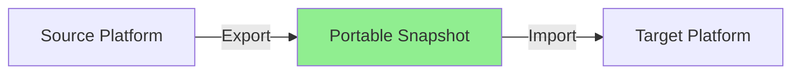

# Platform Migration Guide

This guide explains how to migrate your metadata between different platforms using Lumos's portable snapshot format.

## Overview

Lumos provides a platform-agnostic approach to metadata management. You can export all your metadata to a portable format and import it into any supported platform, eliminating vendor lock-in.

## Supported Platforms

### Currently Supported
- **DataHub** [ok] (Fully implemented)

### Coming Soon
- **Amundsen** [planned]
- **Apache Atlas** [planned]
- **OpenMetadata** [planned]
- **Snowflake Catalog** [planned]

## Migration Workflow



### Step 1: Export Metadata from Source Platform

Export all metadata from your current platform to Lumos's portable snapshot format:

```bash
# Export all metadata to portable format
python framework_cli.py snapshot:export --platform datahub --output metadata_snapshot.json

# Export specific datasets
python framework_cli.py snapshot:export --platform datahub --datasets dataset1,dataset2 --output partial_snapshot.json
```

**What Gets Exported:**
- Dataset schemas and field definitions
- Lineage relationships (upstream/downstream)
- Ownership information (users, groups, assignments)
- Tags and glossary terms
- Custom properties
- Version history
- Quality metrics
- Documentation and descriptions

### Step 2: Validate Snapshot

Before importing, validate the snapshot format:

```bash
# Validate snapshot format
python framework_cli.py snapshot:validate --snapshot metadata_snapshot.json

# Check for issues
python framework_cli.py snapshot:validate --snapshot metadata_snapshot.json --verbose
```

**Validation Checks:**
- Schema format compliance
- Required fields present
- URN format correctness
- Reference integrity (lineage, ownership)
- Version compatibility

### Step 3: Transform (If Needed)

Some platforms may require transformations. Lumos provides transformation utilities:

```bash
# Transform snapshot for target platform
python framework_cli.py snapshot:transform \
    --snapshot metadata_snapshot.json \
    --target-platform amundsen \
    --output transformed_snapshot.json
```

**Common Transformations:**
- URN format conversion
- Property name mapping
- Ownership model translation
- Tag/glossary term mapping

### Step 4: Import to Target Platform

Import the snapshot into your target platform:

```bash
# Import snapshot to target platform
python framework_cli.py snapshot:import \
    --snapshot metadata_snapshot.json \
    --target-platform amundsen \
    --dry-run  # Test first

# Actual import
python framework_cli.py snapshot:import \
    --snapshot metadata_snapshot.json \
    --target-platform amundsen
```

**Import Options:**
- `--dry-run`: Validate without importing
- `--skip-existing`: Skip datasets that already exist
- `--overwrite`: Overwrite existing datasets
- `--batch-size`: Import in batches (for large snapshots)

### Step 5: Verify Migration

After import, verify the migration:

```bash
# Compare source and target
python framework_cli.py snapshot:compare \
    --source-platform datahub \
    --target-platform amundsen \
    --datasets dataset1,dataset2

# Generate migration report
python framework_cli.py snapshot:report \
    --source-snapshot metadata_snapshot.json \
    --target-platform amundsen \
    --output migration_report.html
```

## Migration Scenarios

### Scenario 1: DataHub to Amundsen

**Use Case:** Migrating from DataHub to Amundsen for cost savings (Amundsen is open-source).

```bash
# 1. Export from DataHub
python framework_cli.py snapshot:export \
    --platform datahub \
    --output datahub_export.json

# 2. Transform for Amundsen
python framework_cli.py snapshot:transform \
    --snapshot datahub_export.json \
    --target-platform amundsen \
    --output amundsen_import.json

# 3. Import to Amundsen
python framework_cli.py snapshot:import \
    --snapshot amundsen_import.json \
    --target-platform amundsen
```

**Key Transformations:**
- DataHub URNs -> Amundsen resource keys
- DataHub ownership model -> Amundsen ownership model
- DataHub tags -> Amundsen badges

### Scenario 2: Partial Migration (Specific Datasets)

**Use Case:** Migrating only critical datasets to a new platform.

```bash
# Export specific datasets
python framework_cli.py snapshot:export \
    --platform datahub \
    --datasets customer_data,revenue_analytics,user_events \
    --output critical_datasets.json

# Import to target platform
python framework_cli.py snapshot:import \
    --snapshot critical_datasets.json \
    --target-platform snowflake
```

### Scenario 3: Multi-Platform Consolidation

**Use Case:** Consolidating metadata from multiple platforms into one.

```bash
# Export from multiple platforms
python framework_cli.py snapshot:export --platform datahub --output datahub.json
python framework_cli.py snapshot:export --platform snowflake --output snowflake.json

# Merge snapshots
python framework_cli.py snapshot:merge \
    --snapshots datahub.json,snowflake.json \
    --output consolidated.json

# Import to unified platform
python framework_cli.py snapshot:import \
    --snapshot consolidated.json \
    --target-platform amundsen
```

## Portable Snapshot Format

The portable snapshot format is a standardized JSON schema that represents all metadata in a platform-agnostic way.

### Snapshot Structure

```json
{
  "snapshot_version": "1.0.0",
  "exported_at": "2024-01-15T10:30:00Z",
  "source_platform": "datahub",
  "metadata": {
    "datasets": [
      {
        "urn": "urn:li:dataset:(csv,customer_data,PROD)",
        "name": "customer_data",
        "platform": "csv",
        "environment": "PROD",
        "schema": {
          "fields": [
            {
              "name": "customer_id",
              "type": "string",
              "nullable": false,
              "description": "Unique customer identifier"
            }
          ]
        },
        "lineage": {
          "upstream": ["urn:li:dataset:(postgres,customers,PROD)"],
          "downstream": ["urn:li:dataset:(snowflake,customer_analytics,PROD)"]
        },
        "ownership": {
          "owners": [
            {
              "type": "TECHNICAL_OWNER",
              "owner": "urn:li:corpuser:john.doe"
            }
          ]
        },
        "tags": ["customer-data", "pii"],
        "properties": {
          "cost_per_month": 500.00,
          "row_count": 1000000
        },
        "versions": {
          "cloud_version": "S-312",
          "schema_version": "2.0.0"
        }
      }
    ],
    "users": [...],
    "groups": [...],
    "glossary_terms": [...]
  }
}
```

### Snapshot Versioning

The snapshot format is versioned to ensure compatibility:

- **v1.0.0**: Initial format (current)
- Future versions will maintain backward compatibility

## Best Practices

### Before Migration

1. **Backup Current Metadata**
   ```bash
   python framework_cli.py snapshot:export --platform datahub --output backup_$(date +%Y%m%d).json
   ```

2. **Test with Small Dataset**
   - Export a single dataset
   - Import to target platform
   - Verify correctness
   - Then proceed with full migration

3. **Review Platform Differences**
   - Check supported features
   - Identify unsupported features
   - Plan workarounds if needed

### During Migration

1. **Use Dry-Run First**
   ```bash
   python framework_cli.py snapshot:import --snapshot snapshot.json --target-platform amundsen --dry-run
   ```

2. **Import in Batches**
   ```bash
   python framework_cli.py snapshot:import --snapshot snapshot.json --target-platform amundsen --batch-size 100
   ```

3. **Monitor Progress**
   - Check import logs
   - Verify datasets as they're imported
   - Handle errors immediately

### After Migration

1. **Verify Completeness**
   - Compare dataset counts
   - Verify lineage relationships
   - Check ownership assignments

2. **Update Integrations**
   - Update API endpoints
   - Update CLI configurations
   - Update CI/CD pipelines

3. **Train Team**
   - New platform UI/features
   - Updated workflows
   - New capabilities

## Troubleshooting

### Common Issues

**Issue: URN Format Mismatch**
```
Error: Invalid URN format for target platform
```
**Solution:** Use transformation step to convert URNs:
```bash
python framework_cli.py snapshot:transform --snapshot snapshot.json --target-platform amundsen
```

**Issue: Missing Required Fields**
```
Error: Required field 'description' missing for dataset X
```
**Solution:** Add missing fields or use `--skip-missing` flag:
```bash
python framework_cli.py snapshot:import --snapshot snapshot.json --target-platform amundsen --skip-missing
```

**Issue: Large Snapshot Timeout**
```
Error: Import timeout after 30 minutes
```
**Solution:** Import in smaller batches:
```bash
python framework_cli.py snapshot:import --snapshot snapshot.json --target-platform amundsen --batch-size 50
```

## Migration Checklist

- [ ] Export metadata from source platform
- [ ] Validate snapshot format
- [ ] Review platform differences
- [ ] Test with small dataset
- [ ] Transform snapshot if needed
- [ ] Dry-run import
- [ ] Full import
- [ ] Verify migration completeness
- [ ] Update integrations
- [ ] Train team on new platform
- [ ] Archive old platform (after verification period)

## Support

For migration assistance:
- Check [documentation](../README.md)
- Open an issue on GitHub
- Contact the Lumos community

