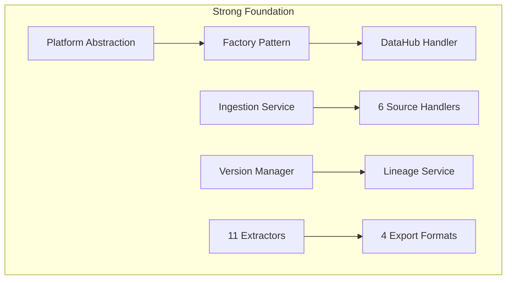

# Lumos Current State Assessment & Gap Analysis Report

## Executive Summary

This report provides a comprehensive assessment of Lumos's current implementation state, identifies critical gaps against the complete vision, and provides recommendations for achieving industry leadership in metadata management.

**Assessment Date:** January 2024  
**Current Version:** 0.1.0  
**Vision Target:** Industry's first platform-agnostic, cost-aware, automatically-detecting metadata platform

---

## Table of Contents

1. [Architecture Analysis](#architecture-analysis)
2. [Feature Completeness Matrix](#feature-completeness-matrix)
3. [Critical Gaps Identified](#critical-gaps-identified)
4. [Technical Debt Assessment](#technical-debt-assessment)
5. [Recommendations](#recommendations)

---

Current implementation status is detailed in `docs/vision/06_implementation_status.md`.

---

## Architecture Analysis

### Current Architecture Strengths

**Strengths:**
1. **Clean Separation of Concerns** - Controllers, Services, Handlers are well-separated
2. **Dependency Inversion** - High-level services depend on abstractions
3. **Open/Closed Principle** - Easy to extend without modification
4. **Factory Patterns** - Consistent handler creation
5. **Configuration-Driven** - JSON/YAML configuration throughout

### Architecture Gaps

**Missing Components:**
1. [no] Change Detection Layer
2. [no] Cost Calculation Layer
3. [no] Snapshot Format System
4. [no] Schema History Storage
5. [no] CI/CD Integration Layer
6. [no] Cross-Platform Connectors (beyond DataHub)

---

## Feature Completeness Matrix

| Feature Category | Current State | Vision Target | Gap | Priority |
|-----------------|---------------|---------------|-----|----------|
| **Platform Abstraction** | [ok] 100% | [ok] 100% | None | - |
| **Data Source Ingestion** | [ok] 90% | [ok] 100% | Minor: More sources | P2 |
| **Automatic Change Detection** | [no] 0% | [ok] 100% | **Critical** | P0 |
| **Schema Change Tracking** | [warn] 20% | [ok] 100% | **Critical** | P0 |
| **Cost Calculation** | [no] 0% | [ok] 100% | **Critical** | P0 |
| **Snapshot Format** | [no] 0% | [ok] 100% | **Critical** | P0 |
| **Version Management** | [ok] 70% | [ok] 100% | CI/CD integration | P1 |
| **Lineage Tracking** | [ok] 90% | [ok] 100% | Cost attribution | P1 |
| **Extraction & Analytics** | [ok] 95% | [ok] 100% | Cost extractor | P1 |
| **Ownership Management** | [ok] 100% | [ok] 100% | None | - |
| **CI/CD Integration** | [no] 0% | [ok] 100% | **Critical** | P1 |
| **Cross-Platform Connectors** | [warn] 10% | [ok] 100% | Snowflake, BigQuery, etc. | P1 |
| **Governance Dashboard** | [warn] 30% | [ok] 100% | Real-time visibility | P2 |

**Overall Completeness:** ~45% of vision achieved

---

## Critical Gaps Identified

### Gap 1: Automatic Change Detection (CDC) [no]

**Current State:**
- Manual ingestion only via CLI
- No automatic detection of schema changes
- No event-driven updates

**Impact:**
- **Core value proposition missing** - "Never dependent on developer" cannot be achieved
- Manual tracking overhead remains
- Schema drift goes undetected

**Required Components:**
1. S3 event watcher (SQS integration)
2. HDFS filesystem scanner
3. Database schema polling service
4. Schema comparator
5. Change event store

**Effort:** 3 weeks (P0)

---

### Gap 2: Real Schema Change Tracking [warn]

**Current State:**
- `MetadataDiffService` only simulates changes
- No historical schema storage
- No real change tracking

**Impact:**
- Cannot track actual schema evolution
- No breaking change detection
- No impact analysis on downstream datasets

**Required Components:**
1. Schema history store (SQLite/PostgreSQL)
2. Schema change analyzer
3. Evolution reporting
4. Breaking change predictor

**Effort:** 2 weeks (P0)

---

### Gap 3: Cost Calculation & FinOps [no]

**Current State:**
- No cost tracking whatsoever
- No FinOps capabilities

**Impact:**
- **Major differentiator missing** - Cost calculation is unique in market
- Cannot help enterprises optimize data spend
- No feature shutdown savings calculator

**Required Components:**
1. Storage cost calculator
2. Compute cost tracker
3. Lineage cost attribution engine
4. Savings calculator
5. Cost extractor service

**Effort:** 2 weeks (P0)

---

### Gap 4: Snapshot Format & Portability [no]

**Current State:**
- Metadata stored only in DataHub format
- No export/import capability
- No migration path

**Impact:**
- **Vendor lock-in** - Cannot migrate between platforms
- No backup/restore capability
- No version control integration

**Required Components:**
1. Lumos snapshot format specification
2. Snapshot exporter
3. Snapshot importer
4. Migration service

**Effort:** 1 week (P0)

---

### Gap 5: Jenkins CI/CD Integration [no]

**Current State:**
- Version management exists but no CI/CD integration
- Manual version updates only

**Impact:**
- Cannot automate version bumps
- No Git tagging integration
- Manual workflow overhead

**Required Components:**
1. Jenkins plugin
2. Pipeline step implementation
3. Git tagging integration
4. Jenkinsfile templates

**Effort:** 1 week (P1)

---

### Gap 6: Cross-Platform Connectors [warn]

**Current State:**
- Only DataHub handler implemented
- No Snowflake, BigQuery, Redshift, etc.

**Impact:**
- Limited platform support
- Cannot provide unified view across platforms

**Required Components:**
1. Snowflake handler
2. BigQuery handler
3. Redshift handler
4. OpenMetadata handler
5. Amundsen handler

**Effort:** 4 weeks (P1)

---

For competitive positioning, see `docs/vision/07_competitive_analysis.md`.

---

## Technical Debt Assessment

### Low Technical Debt [ok]

**Strengths:**
- Clean architecture with SOLID principles
- Well-structured codebase
- Good separation of concerns
- Comprehensive error handling
- Type hints throughout

### Areas for Improvement

1. **Documentation**
   - Current: Good architecture docs
   - Needed: CTO-focused README, use cases, migration guides

2. **Testing**
   - Current: Basic test structure
   - Needed: Comprehensive test coverage, integration tests

3. **Performance**
   - Current: Not optimized for scale
   - Needed: Pagination, async processing, caching

4. **Observability**
   - Current: Basic logging
   - Needed: Metrics, tracing, dashboards

---

## Recommendations

### Immediate Actions (P0 - Weeks 1-8)

1. **Implement Automatic Change Detection** (3 weeks)
   - Highest priority - core value proposition
   - Start with S3 event watcher
   - Add HDFS scanner and database polling

2. **Implement Real Schema Tracking** (2 weeks)
   - Replace simulation with real tracking
   - Add schema history store
   - Implement change analyzer

3. **Implement Cost Calculation** (2 weeks)
   - Storage cost calculator
   - Compute cost tracker
   - Savings calculator

4. **Implement Snapshot Format** (1 week)
   - Define format specification
   - Implement exporter/importer
   - Enable platform migration

### Short-term Actions (P1 - Weeks 9-13)

5. **Jenkins Integration** (1 week)
   - Create Jenkins plugin
   - Add CI/CD templates

6. **Cross-Platform Connectors** (4 weeks)
   - Snowflake handler
   - BigQuery handler
   - Redshift handler
   - OpenMetadata handler

### Long-term Actions (P2 - Future)

7. **Governance Dashboard** (2 weeks)
   - Real-time quality visibility
   - Cost dashboards
   - Compliance tracking

8. **Performance Optimization** (Ongoing)
   - Pagination for large datasets
   - Async processing
   - Caching layer

---

## Risk Assessment

### Technical Risks

| Risk | Probability | Impact | Mitigation |
|------|------------|--------|------------|
| S3 event setup complexity | Medium | Medium | Detailed guides, scripts |
| Cost calculation accuracy | Low | High | Conservative estimates, overrides |
| Platform migration data loss | Low | Critical | Comprehensive testing |
| Performance at scale | Medium | Medium | Pagination, async, caching |

### Business Risks

| Risk | Probability | Impact | Mitigation |
|------|------------|--------|------------|
| Competitive response | High | Medium | First-mover advantage |
| Slow adoption | Medium | Medium | Strong docs, use cases |
| Resource constraints | Low | Low | Phased approach |

---

## Success Criteria

### Technical Success

- [ok] 100% schema change detection rate
- [ok] Cost calculation within 5% accuracy
- [ok] 99%+ snapshot import/export success
- [ok] Zero data loss in platform migrations

### Business Success

- [ok] CTO understands value in < 30 seconds
- [ok] Clear differentiation from competitors
- [ok] 10+ enterprise adoptions in 6 months
- [ok] 100+ GitHub stars, active community

---

## Conclusion

Lumos has a **strong foundation** with excellent architecture and comprehensive feature coverage in core areas. However, **critical gaps** exist in automatic detection, cost calculation, and platform portability - these are the key differentiators for market leadership.

**Current State:** ~45% of vision achieved  
**Path Forward:** 14 weeks of focused development to achieve 100% vision  
**Outcome:** Industry-leading platform with unique capabilities

**Recommendation:** **PROCEED** with implementation plan. The foundation is solid, gaps are clear, and the path forward is well-defined.

---

**Assessment Conducted By:** Lumos Development Team  
**Date:** January 2024  
**Next Review:** After Phase 1 completion
